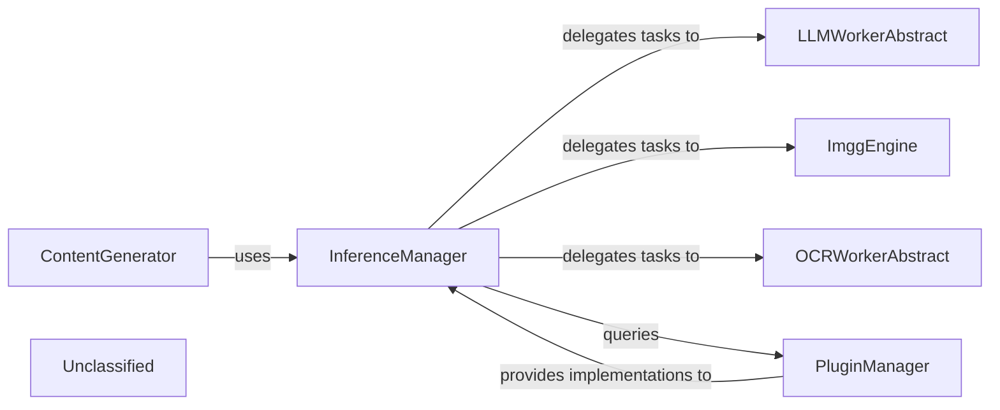

## Details

The core of the `pipelex` AI subsystem revolves around the `InferenceManager`, which acts as a central orchestrator for various AI tasks. It dynamically manages and delegates requests to specialized worker components like `LLMWorkerAbstract` for language models, `ImggEngine` for image generation, and `OCRWorkerAbstract` for optical character recognition. The `PluginManager` plays a crucial role in extending the system's capabilities by providing concrete implementations of these abstract workers to the `InferenceManager`. Higher-level components like `ContentGenerator` leverage the `InferenceManager` to compose complex AI workflows, demonstrating a clear separation of concerns and promoting extensibility through its plugin-based architecture. This design allows for flexible integration of diverse AI models and services, making the system adaptable to evolving AI landscapes.

### InferenceManager
Acts as the central orchestrator and facade for all AI inference tasks. It provides a unified entry point for AI requests and intelligently routes them to the appropriate specialized AI worker or engine based on the task type (LLM, image generation, OCR). This component is fundamental for abstracting the underlying AI services and centralizing inference control, aligning with the "Workflow Orchestrator/Engine" pattern.

**Related Classes/Methods**:

- <a href="https://github.com/Pipelex/pipelex/blob/mainpipelex/cogt/inference/inference_manager.py#L21-L159" target="_blank" rel="noopener noreferrer">`pipelex.cogt.inference.inference_manager.InferenceManager`:21-159</a>

### LLMWorkerAbstract
An abstract base class that defines the standardized interface for interacting with Large Language Models. It embodies the 'LLM Adapters/Providers' pattern, ensuring that different LLM backends can be seamlessly integrated and interchanged. This abstraction is critical for maintaining modularity and extensibility within the AI service layer.

**Related Classes/Methods**:

- <a href="https://github.com/Pipelex/pipelex/blob/mainpipelex/cogt/llm/llm_worker_abstract.py#L14-L121" target="_blank" rel="noopener noreferrer">`pipelex.cogt.llm.llm_worker_abstract.LLMWorkerAbstract`:14-121</a>

### ImggEngine
A concrete component responsible for handling image generation requests. It encapsulates the specific logic and API calls required to interact with image generation services. This component represents a specific 'Tool/Service Integration' within the AI abstraction, demonstrating how diverse AI capabilities are integrated.

**Related Classes/Methods**:

- <a href="https://github.com/Pipelex/pipelex/blob/mainpipelex/cogt/imgg/imgg_engine.py#L6-L12" target="_blank" rel="noopener noreferrer">`pipelex.cogt.imgg.imgg_engine.ImggEngine`:6-12</a>

### OCRWorkerAbstract
An abstract base class for Optical Character Recognition services, providing a unified interface for different OCR providers. Similar to `LLMWorkerAbstract`, it defines the contract for OCR services, allowing for interchangeable OCR backends and supporting the "Tool/Service Integrations" pattern.

**Related Classes/Methods**:

- <a href="https://github.com/Pipelex/pipelex/blob/mainpipelex/cogt/ocr/ocr_worker_abstract.py#L15-L73" target="_blank" rel="noopener noreferrer">`pipelex.cogt.ocr.ocr_worker_abstract.OcrWorkerAbstract`:15-73</a>

### ContentGenerator
This component orchestrates multiple AI services (primarily LLMs) to generate more complex content. It acts as a higher-level consumer of the AI abstraction layer, composing and orchestrating calls to various AI services to produce structured or creative content. It represents a key aspect of the "Pipe Executors/Runners" by defining how AI tasks are combined into meaningful workflows.

**Related Classes/Methods**:

- <a href="https://github.com/Pipelex/pipelex/blob/mainpipelex/cogt/content_generation/content_generator.py#L38-L280" target="_blank" rel="noopener noreferrer">`pipelex.cogt.content_generation.content_generator.ContentGenerator`:38-280</a>

### PluginManager
Essential for the 'Extensibility/Plugin-based Architecture,' this component manages the discovery, loading, and provision of concrete AI service implementations (e.g., specific LLM or OCR providers). It facilitates the dynamic extension of AI service capabilities, which is crucial for an AI Workflow Orchestration Library to support new and evolving AI models and services.

**Related Classes/Methods**:

- <a href="https://github.com/Pipelex/pipelex/blob/mainpipelex/plugins/plugin_manager.py#L4-L12" target="_blank" rel="noopener noreferrer">`pipelex.plugins.plugin_manager.PluginManager`:4-12</a>

### Unclassified
Component for all unclassified files and utility functions (Utility functions/External Libraries/Dependencies)

**Related Classes/Methods**: _None_

### [FAQ](https://github.com/CodeBoarding/GeneratedOnBoardings/tree/main?tab=readme-ov-file#faq)
