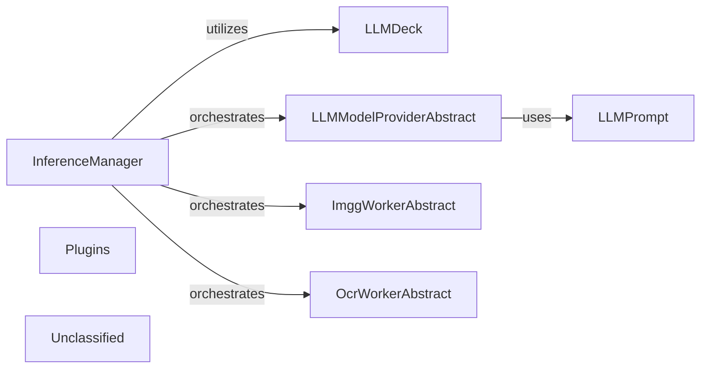

## Details

The AI Service Integration Layer serves as a crucial abstraction layer, centralizing the management and interaction with diverse AI services. The `InferenceManager` acts as the orchestrator, directing requests to specialized abstract provider interfaces (`LLMModelProviderAbstract`, `ImggWorkerAbstract`, `OcrWorkerAbstract`). The `LLMDeck` supports LLM operations by managing model configurations and selection. `LLMPrompt` is essential for dynamically constructing prompts for LLM interactions. The `Plugins` component ensures the extensibility of this layer, allowing for seamless integration of new AI service providers, thereby enhancing the overall flexibility and capabilities of the system.

### InferenceManager
Acts as the primary facade for all AI inference operations within the subsystem. It orchestrates incoming requests, routes them to the appropriate specialized AI service providers (LLM, Image Generation, OCR), and manages their setup and configuration. It receives inference requests and delegates to specific `LLMModelProviderAbstract`, `ImggWorkerAbstract`, and `OcrWorkerAbstract` implementations, utilizing `LLMDeck` for LLM model selection and configuration.

**Related Classes/Methods**:

- <a href="https://github.com/Pipelex/pipelex/blob/main/pipelex/cogt/inference/inference_manager.py#L23-L186" target="_blank" rel="noopener noreferrer">`pipelex.cogt.inference.inference_manager.InferenceManager`:23-186</a>

### LLMDeck
Manages a comprehensive registry of available LLM models, their configurations, and associated metadata (e.g., capabilities, cost parameters). It provides validation and selection logic for LLM settings to ensure compatibility and optimal usage. It is consulted by `InferenceManager` or `LLMModelProviderAbstract` implementations for model selection, configuration, and potentially cost tracking.

**Related Classes/Methods**:

- <a href="https://github.com/Pipelex/pipelex/blob/main/pipelex/cogt/llm/llm_models/llm_deck.py#L19-L161" target="_blank" rel="noopener noreferrer">`pipelex.cogt.llm.llm_models.llm_deck.LLMDeck`:19-161</a>

### LLMModelProviderAbstract
Defines the abstract interface for encapsulating specific API calls, authentication, and data formatting required to interact with individual Large Language Model providers (e.g., Anthropic, Google, Mistral, AWS Bedrock). It translates generic inference requests into provider-specific formats. It is called by `InferenceManager` and communicates directly with external LLM APIs, potentially utilizing `LLMPrompt` for dynamic prompt generation.

**Related Classes/Methods**:

- <a href="https://github.com/Pipelex/pipelex/blob/main/pipelex/cogt/llm/llm_models/llm_model_provider_abstract.py#L8-L42" target="_blank" rel="noopener noreferrer">`pipelex.cogt.llm.llm_models.llm_model_provider_abstract.LLMModelProviderAbstract`:8-42</a>

### ImggWorkerAbstract
Defines the abstract interface for handling provider-specific API interactions for various image generation services. It is called by `InferenceManager` and communicates with external Image Generation APIs.

**Related Classes/Methods**:

- <a href="https://github.com/Pipelex/pipelex/blob/main/pipelex/cogt/imgg/imgg_worker_abstract.py#L15-L107" target="_blank" rel="noopener noreferrer">`pipelex.cogt.imgg.imgg_worker_abstract.ImggWorkerAbstract`:15-107</a>

### OcrWorkerAbstract
Defines the abstract interface for managing provider-specific API calls for Optical Character Recognition services. It is called by `InferenceManager` and communicates with external OCR APIs.

**Related Classes/Methods**:

- <a href="https://github.com/Pipelex/pipelex/blob/main/pipelex/cogt/ocr/ocr_worker_abstract.py#L15-L71" target="_blank" rel="noopener noreferrer">`pipelex.cogt.ocr.ocr_worker_abstract.OcrWorkerAbstract`:15-71</a>

### LLMPrompt
Represents and manages the structure and content of prompts for LLM models. It facilitates the dynamic construction and formatting of prompts suitable for different LLM models and providers, potentially incorporating templating, context injection, and few-shot examples. It is used by `LLMModelProviderAbstract` implementations (and potentially `InferenceManager`) to prepare input for LLM calls.

**Related Classes/Methods**:

- <a href="https://github.com/Pipelex/pipelex/blob/main/pipelex/cogt/llm/llm_prompt.py#L13-L85" target="_blank" rel="noopener noreferrer">`pipelex.cogt.llm.llm_prompt.LLMPrompt`:13-85</a>

### Plugins
Provides extension points for integrating new or custom AI service providers into the AI Service Integration Layer, adhering to a plugin architecture. This allows for flexible expansion of supported AI services.

**Related Classes/Methods**:

- <a href="https://github.com/Pipelex/pipelex/blob/main/pipelex/plugins/__init__.py" target="_blank" rel="noopener noreferrer">`pipelex.plugins.__init__.py`</a>

### Unclassified
Component for all unclassified files and utility functions (Utility functions/External Libraries/Dependencies)

**Related Classes/Methods**: _None_

### [FAQ](https://github.com/CodeBoarding/GeneratedOnBoardings/tree/main?tab=readme-ov-file#faq)
