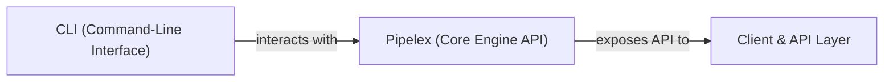

## Details

The `Client & API Layer` is fundamentally important as it defines how users and other systems access the workflow orchestration capabilities. Separating it into `CLI` and `Pipelex (Core Engine API)` components aligns with the "Workflow Orchestration Engine / AI Workflow Framework" pattern by distinguishing between direct human interaction (CLI) and programmatic integration (API). This separation promotes modularity, allowing different types of clients to interact with the core engine through appropriate interfaces, which is crucial for extensibility and maintainability in an AI workflow framework.

### Client & API Layer [[Expand]](./Client_API_Layer.md)
This layer serves as the primary interface for external users and systems to interact with the Pipelex engine. It encompasses both the command-line interface for direct user interaction and the programmatic API exposed by the core `Pipelex` engine for integration with other systems or custom scripts. It acts as the gateway for initiating, managing, and monitoring AI workflows.

**Related Classes/Methods**:

- `pipelex.cli._cli`
- <a href="https://github.com/CodeBoarding/pipelex/blob/main/pipelex/pipelex.py#L60-L304" target="_blank" rel="noopener noreferrer">`pipelex.pipelex.Pipelex` (60:304)</a>

### CLI (Command-Line Interface)
The `CLI` component provides a user-friendly command-line interface, enabling users to directly execute Pipelex commands, validate pipeline configurations, and manage workflow executions. It is the primary entry point for manual user interaction with the Pipelex system.

**Related Classes/Methods**:

- `pipelex.cli._cli`

### Pipelex (Core Engine API)
While `Pipelex` represents the core orchestration engine, its public methods and attributes form the primary programmatic API. This API allows external clients, including the `CLI` and other integrated systems, to programmatically control and manage workflows, define pipelines, and interact with the engine's functionalities.

**Related Classes/Methods**:

- <a href="https://github.com/CodeBoarding/pipelex/blob/main/pipelex/pipelex.py#L60-L304" target="_blank" rel="noopener noreferrer">`pipelex.pipelex.Pipelex` (60:304)</a>

### [FAQ](https://github.com/CodeBoarding/GeneratedOnBoardings/tree/main?tab=readme-ov-file#faq)
