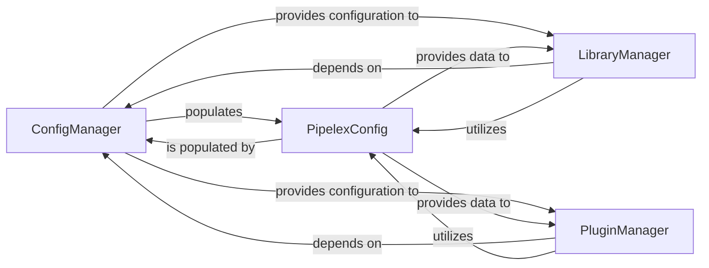

## Details

This subsystem is responsible for managing all aspects of system configuration, workflow definitions, reusable components, and external plugins, ensuring the system's adaptability and future-proofing.

### ConfigManager
Serves as the primary interface for loading, merging, and providing access to all system-wide and workflow-specific configuration settings. It handles the parsing of TOML-based definitions and ensures configuration consistency across the Pipelex ecosystem.

**Related Classes/Methods**:

- <a href="https://github.com/CodeBoarding/pipelex/blob/main/pipelex/tools/config/manager.py#L22-L222" target="_blank" rel="noopener noreferrer">`pipelex.tools.config.manager.ConfigManager` (22:222)</a>

### PipelexConfig
Acts as the central data structure holding the loaded and validated configuration parameters for the entire Pipelex system. It provides a structured and accessible representation of all settings, including paths to libraries and plugin directories, enabling consistent access to configuration data.

**Related Classes/Methods**:

- <a href="https://github.com/CodeBoarding/pipelex/blob/main/pipelex/config.py#L113-L116" target="_blank" rel="noopener noreferrer">`pipelex.config.PipelexConfig` (113:116)</a>

### LibraryManager
Orchestrates the discovery, loading, and validation of all workflow-related components (domains, concepts, pipes) defined in TOML files and registered Python classes. It acts as the central registry for reusable workflow building blocks, ensuring their availability and proper integration into the core engine.

**Related Classes/Methods**:

- `pipelex.libraries.library_manager.Library_Manager`

### PluginManager
Manages the lifecycle of external plugins, including their discovery, loading, initialization, and teardown. This component is crucial for extending Pipelex's capabilities with new LLM providers, custom operators, or other integrations without modifying the core codebase, adhering to the microkernel/core-plugin pattern.

**Related Classes/Methods**:

- <a href="https://github.com/CodeBoarding/pipelex/blob/main/pipelex/plugins/plugin_manager.py#L8-L26" target="_blank" rel="noopener noreferrer">`pipelex.plugins.plugin_manager.PluginManager` (8:26)</a>

### [FAQ](https://github.com/CodeBoarding/GeneratedOnBoardings/tree/main?tab=readme-ov-file#faq)
