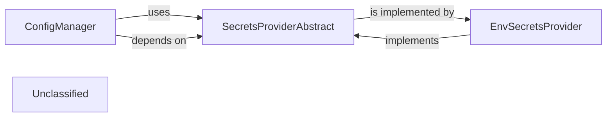

## Details

The `pipelex` configuration and secrets management subsystem is built around a central `ConfigManager` that orchestrates the loading and merging of various configuration sources. This manager relies on an abstract `SecretsProviderAbstract` interface to securely retrieve sensitive information, promoting a clear separation of concerns. The `EnvSecretsProvider` is a concrete implementation of this interface, enabling the system to fetch secrets directly from environment variables. This design ensures flexibility in how configurations are managed and secrets are accessed, allowing for easy extension with different secret storage mechanisms while maintaining a consistent configuration loading process.

### ConfigManager
The core component responsible for loading, parsing, validating, and providing access to all project-wide configuration settings. It acts as the central authority for configuration data, ensuring consistency and proper structure for workflow definitions and tool integrations.

**Related Classes/Methods**:

- <a href="https://github.com/Pipelex/pipelex/blob/mainpipelex/tools/config/manager.py" target="_blank" rel="noopener noreferrer">`pipelex.tools.config.manager:ConfigManager`</a>

### SecretsProviderAbstract
Defines a standardized, abstract interface for retrieving sensitive information (e.g., API keys, credentials). This abstraction allows for multiple concrete implementations, promoting extensibility and decoupling the configuration manager from specific secret storage mechanisms.

**Related Classes/Methods**:

- <a href="https://github.com/Pipelex/pipelex/blob/mainpipelex/tools/secrets/secrets_provider_abstract.py" target="_blank" rel="noopener noreferrer">`pipelex.tools.secrets.secrets_provider_abstract:SecretsProviderAbstract`</a>

### EnvSecretsProvider
A concrete implementation of the SecretsProviderAbstract interface, specifically designed to retrieve sensitive information from environment variables. This provides a common and easily deployable method for injecting secrets into the workflow execution environment.

**Related Classes/Methods**:

- <a href="https://github.com/Pipelex/pipelex/blob/mainpipelex/tools/secrets/env_secrets_provider.py" target="_blank" rel="noopener noreferrer">`pipelex.tools.secrets.env_secrets_provider:EnvSecretsProvider`</a>

### Unclassified
Component for all unclassified files and utility functions (Utility functions/External Libraries/Dependencies)

**Related Classes/Methods**: _None_

### [FAQ](https://github.com/CodeBoarding/GeneratedOnBoardings/tree/main?tab=readme-ov-file#faq)
