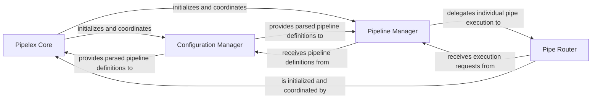

## Details

The `Core Orchestration Engine` subsystem is the heart of Pipelex, responsible for interpreting declarative pipeline definitions and managing the execution flow of individual operations. It embodies the core pipeline architecture pattern, ensuring that workflows are parsed, managed, and executed efficiently.

### Pipelex Core
The primary entry point and top-level orchestrator of the entire Pipelex system. It is responsible for the overall system lifecycle, including initializing and coordinating the main managers (Configuration, Pipeline, and Pipe Router), acting as the central hub that initiates the orchestration process.

**Related Classes/Methods**:

- <a href="https://github.com/Pipelex/pipelex/blob/main/pipelex/pipelex.py#L60-L304" target="_blank" rel="noopener noreferrer">`pipelex.pipelex.Pipelex` (60:304)</a>

### Configuration Manager
Dedicated to loading, parsing, and validating declarative pipeline definitions from TOML files. It ensures that workflows are correctly structured and provides the necessary configuration data to other core components for execution.

**Related Classes/Methods**:

- `pipelex.config`

### Pipeline Manager
Manages the lifecycle of defined pipelines, including their registration, retrieval, and overall execution flow. It oversees the high-level orchestration of a complete pipeline, delegating the execution of individual pipes to the Pipe Router.

**Related Classes/Methods**:

- <a href="https://github.com/Pipelex/pipelex/blob/main/pipelex/pipeline/pipeline_manager.py#L13-L43" target="_blank" rel="noopener noreferrer">`pipelex.pipeline.pipeline_manager.PipelineManager` (13:43)</a>

### Pipe Router
The core execution engine for individual 'pipes'. It dispatches execution requests for each pipe, manages data flow between them, and invokes the specific logic of each pipe operator. This component directly orchestrates the execution of individual steps within a pipeline.

**Related Classes/Methods**:

- <a href="https://github.com/Pipelex/pipelex/blob/main/pipelex/pipe_works/pipe_router.py#L15-L58" target="_blank" rel="noopener noreferrer">`pipelex.pipe_works.pipe_router.PipeRouter` (15:58)</a>

### [FAQ](https://github.com/CodeBoarding/GeneratedOnBoardings/tree/main?tab=readme-ov-file#faq)
