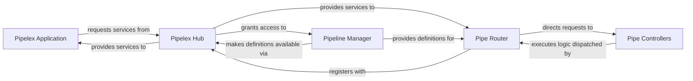

## Details

The Core Pipeline Orchestrator subsystem is responsible for managing and executing AI workflows within the Pipelex system. It encompasses key modules like the Pipelex Application for initialization, the Pipelex Hub for service location, the Pipeline Manager for handling pipeline definitions, the Pipe Router for execution dispatch, and Pipe Controllers for concrete pipe execution logic. Its main purpose is to provide a robust and extensible framework for orchestrating AI pipelines.

### Pipelex Application
Serves as the primary entry point for the Pipelex system. It is responsible for initializing the entire Pipelex environment, including core libraries and configurations, and initiating the overall orchestration process. This component embodies the "Engine" aspect of an AI Workflow Orchestration Library.

**Related Classes/Methods**:

- <a href="https://github.com/Pipelex/pipelex/blob/main/pipelex/pipelex.py#L61-L305" target="_blank" rel="noopener noreferrer">`pipelex.pipelex`:61-305</a>

### Pipelex Hub
Functions as the central service locator and dependency injection point within the Pipelex ecosystem. It provides other components, such as the `Pipelex Application` and `Pipe Router`, with access to various managers and providers (e.g., `Pipeline Manager`), ensuring a decoupled and extensible architecture.

**Related Classes/Methods**:

- <a href="https://github.com/Pipelex/pipelex/blob/main/pipelex/hub.py" target="_blank" rel="noopener noreferrer">`pipelex.hub`</a>

### Pipeline Manager
Manages the lifecycle and declarative definitions of pipelines. Its core responsibility is to add new pipeline definitions and retrieve existing ones, focusing on the structural and configuration aspects of pipelines as defined via PLX. This component is crucial for the "Configuration Manager" and "DSL Parser/Interpreter" aspects.

**Related Classes/Methods**:

- <a href="https://github.com/Pipelex/pipelex/blob/main/pipelex/pipeline/pipeline_manager.py" target="_blank" rel="noopener noreferrer">`pipelex.pipeline.pipeline_manager`</a>

### Pipe Router
Acts as the dispatcher for pipe execution within a pipeline. It receives requests to execute specific pipes and directs these requests to the appropriate `Pipe Controllers` based on the pipe's type or configuration, ensuring correct control flow. This component is a key part of the "Pipeline Orchestrator/Engine."

**Related Classes/Methods**:

- <a href="https://github.com/Pipelex/pipelex/blob/main/pipelex/pipe_works/pipe_router.py" target="_blank" rel="noopener noreferrer">`pipelex.pipe_works.pipe_router`</a>

### Pipe Controllers
Encapsulates the concrete execution logic and control flow for individual pipe steps. These are the specialized executors for different types of pipes (e.g., Condition, Parallel, Sequence, Batch), directly implementing the "Pipe Implementations" aspect of the architecture.

**Related Classes/Methods**:

- <a href="https://github.com/Pipelex/pipelex/blob/main/pipelex/pipe_controllers" target="_blank" rel="noopener noreferrer">`pipelex.pipe_controllers`</a>

### [FAQ](https://github.com/CodeBoarding/GeneratedOnBoardings/tree/main?tab=readme-ov-file#faq)
