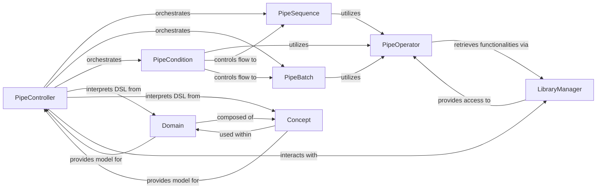

## Details

The `pipelex` subsystem facilitates the creation and execution of domain-specific language (DSL) pipelines. The `PipeController` is the central component, responsible for interpreting the DSL defined by `Domain` and `Concept` elements and orchestrating the pipeline's execution. It leverages `PipeSequence` for sequential operations, `PipeBatch` for parallel processing, and `PipeCondition` for conditional branching, all of which rely on `PipeOperator` for atomic task execution. The `LibraryManager` is vital for extending the system's capabilities by dynamically providing access to various `PipeOperator` implementations, allowing for integration with external tools and services. This modular design ensures flexibility and extensibility in defining and executing complex workflows.

### PipeController
The primary orchestrator and interpreter of the DSL. It takes the defined pipeline (composed of `Domain` and `Concept` elements) and manages its execution flow, delegating to specific control flow components.

**Related Classes/Methods**:

- <a href="https://github.com/Pipelex/pipelex/blob/main/pipelex/pipe_controllers/pipe_controller.py#L14-L79" target="_blank" rel="noopener noreferrer">`PipeController`:14-79</a>

### PipeSequence
Implements sequential execution of `PipeOperator` instances. It ensures that pipeline steps are processed in a predefined, ordered manner, managing data flow between them.

**Related Classes/Methods**:

- <a href="https://github.com/Pipelex/pipelex/blob/main/pipelex/pipe_controllers/pipe_sequence.py#L23-L195" target="_blank" rel="noopener noreferrer">`PipeSequence`:23-195</a>

### PipeBatch
Manages the parallel or batch execution of multiple `PipeOperator` instances. This enables concurrent processing of data or tasks, optimizing workflow performance.

**Related Classes/Methods**:

- <a href="https://github.com/Pipelex/pipelex/blob/main/pipelex/pipe_controllers/pipe_batch.py#L27-L247" target="_blank" rel="noopener noreferrer">`PipeBatch`:27-247</a>

### PipeCondition
Provides conditional branching logic within a pipeline. It evaluates specified criteria and directs the execution flow to different `PipeSequence` or `PipeBatch` paths based on the outcome.

**Related Classes/Methods**:

- <a href="https://github.com/Pipelex/pipelex/blob/main/pipelex/pipe_controllers/pipe_condition.py#L32-L379" target="_blank" rel="noopener noreferrer">`PipeCondition`:32-379</a>

### PipeOperator
Serves as the abstract interface or base class for all individual, atomic operations within a pipeline. Concrete implementations perform specific tasks, such as LLM calls, data transformations, or external tool invocations.

**Related Classes/Methods**:

- <a href="https://github.com/Pipelex/pipelex/blob/main/pipelex/pipe_operators/pipe_operator.py#L16-L90" target="_blank" rel="noopener noreferrer">`PipeOperator`:16-90</a>

### Domain
Defines the high-level structure and entities of the domain-specific language. It provides the conceptual framework for organizing `Concept`s and constructing pipelines, establishing the overall workflow blueprint.

**Related Classes/Methods**:

- <a href="https://github.com/Pipelex/pipelex/blob/main/pipelex/hub.py#L405-L406" target="_blank" rel="noopener noreferrer">`Domain`:405-406</a>

### Concept
Represents fundamental building blocks or atomic units within the `pipelex` DSL. These can be data types, abstract operations, or specific elements that `Domain` utilizes to define the granular aspects of workflows.

**Related Classes/Methods**:

- <a href="https://github.com/Pipelex/pipelex/blob/main/pipelex/hub.py#L448-L449" target="_blank" rel="noopener noreferrer">`Concept`:448-449</a>

### LibraryManager
Manages the loading, registration, and access to external libraries, plugins, or integrations (e.g., LLM providers, specialized tools). It is crucial for the extensibility of the framework, allowing new `PipeOperator` implementations to be dynamically integrated.

**Related Classes/Methods**:

- <a href="https://github.com/Pipelex/pipelex/blob/main/pipelex/libraries/library_manager.py#L56-L406" target="_blank" rel="noopener noreferrer">`LibraryManager`:56-406</a>

### [FAQ](https://github.com/CodeBoarding/GeneratedOnBoardings/tree/main?tab=readme-ov-file#faq)
