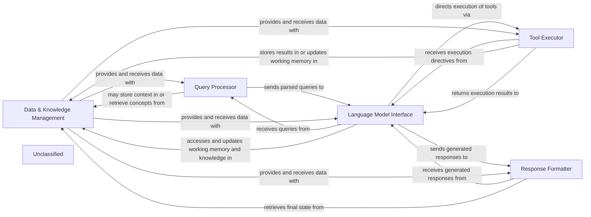

## Details

The `pipelex` system, at its core, orchestrates intelligent content generation and processing. The `Query Processor` initiates workflows by interpreting incoming requests. These requests are then passed to the `Language Model Interface`, which leverages the `Data & Knowledge Management` component to select and configure appropriate models. The `Language Model Interface` can also direct the `Tool Executor` to perform specialized tasks, integrating external capabilities. Finally, the `Response Formatter` structures the generated outputs for consumption. The `Data & Knowledge Management` component acts as a central repository for model configurations, routing logic, and inference backends, ensuring that the right models are used for the right tasks.

### Data & Knowledge Management [[Expand]](./Data_Knowledge_Management.md)
Manages the configuration and specifications of various models, routing profiles, and inference backends. It is responsible for loading model definitions, building the model deck, and providing access to inference models and their associated backends. This component underpins the system's ability to select and utilize appropriate models for different tasks.

**Related Classes/Methods**:

- <a href="https://github.com/Pipelex/pipelex/blob/mainpipelex/cogt/models/model_manager.py#L20-L149" target="_blank" rel="noopener noreferrer">`pipelex.cogt.models.model_manager.ModelManager`:20-149</a>
- <a href="https://github.com/Pipelex/pipelex/blob/mainpipelex/cogt/llm/llm_job.py#L12-L43" target="_blank" rel="noopener noreferrer">`pipelex.cogt.llm.llm_job.LLMJob`:12-43</a>

### Query Processor
Handles incoming user queries or external triggers, including parsing and initial validation, preparing them for further processing by the AI workflow. This component would likely involve interpreting the request and setting up the necessary job parameters for the inference process.

**Related Classes/Methods**:

- <a href="https://github.com/Pipelex/pipelex/blob/mainpipelex/cogt/llm/llm_prompt.py#L11-L85" target="_blank" rel="noopener noreferrer">`pipelex.cogt.llm.llm_prompt.LLMPrompt`:11-85</a>

### Language Model Interface
Provides an abstraction layer for interacting with various large language models, responsible for understanding, reasoning, and generating responses or actions based on processed inputs and leveraging the system's knowledge. This component would manage the execution of LLM jobs.

**Related Classes/Methods**:

- <a href="https://github.com/Pipelex/pipelex/blob/mainpipelex/cogt/llm/llm_worker_abstract.py#L18-L123" target="_blank" rel="noopener noreferrer">`pipelex.cogt.llm.llm_worker_abstract.LLMWorkerAbstract`:18-123</a>
- <a href="https://github.com/Pipelex/pipelex/blob/mainpipelex/cogt/llm/llm_job.py" target="_blank" rel="noopener noreferrer">`pipelex.cogt.llm.llm_job.LLMJob.llm_job_before_start`</a>

### Tool Executor
Manages the execution of external tools, APIs, or specialized functions as directed by the Language Model Interface, integrating external capabilities and real-world interactions into the AI workflow. This would involve interacting with various content generation modules.

**Related Classes/Methods**:

- <a href="https://github.com/Pipelex/pipelex/blob/mainpipelex/cogt/content_generation/content_generator.py#L37-L278" target="_blank" rel="noopener noreferrer">`pipelex.cogt.content_generation.content_generator.ContentGenerator`:37-278</a>

### Response Formatter
Structures and formats the final output from the AI workflow into a user-friendly or system-consumable representation, ensuring clarity and consistency. This would involve processing the reports generated by the LLM jobs.

**Related Classes/Methods**:

- <a href="https://github.com/Pipelex/pipelex/blob/mainpipelex/cogt/llm/llm_report.py" target="_blank" rel="noopener noreferrer">`pipelex.cogt.llm.llm_report.LLMReport`</a>

### Unclassified
Component for all unclassified files and utility functions (Utility functions/External Libraries/Dependencies)

**Related Classes/Methods**: _None_

### [FAQ](https://github.com/CodeBoarding/GeneratedOnBoardings/tree/main?tab=readme-ov-file#faq)
