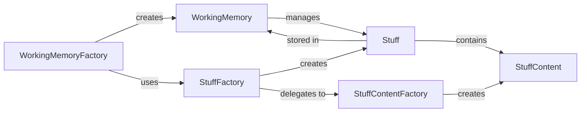

## Details

Abstract Components Overview

### WorkingMemory
Manages the dynamic state of the pipeline by storing and providing access to `Stuff` objects. It ensures data consistency and enables pipes to share and modify data throughout the workflow execution.

**Related Classes/Methods**:

- `pipelex.core.working_memory`

### WorkingMemoryFactory
Initializes `WorkingMemory` instances, potentially populating them with initial `Stuff` objects. It acts as a controlled entry point for setting up the pipeline's state.

**Related Classes/Methods**:

- `pipelex.core.working_memory_factory`

### Stuff
Encapsulates a single, typed data unit. It provides a consistent interface for accessing and manipulating its content, abstracting away the underlying data type. This is the fundamental data carrier within the pipeline.

**Related Classes/Methods**:

- `pipelex.core.stuff`

### StuffContent
Holds the raw data and defines type-specific behaviors (e.g., rendering to string, JSON serialization). Subclasses handle specific data formats (text, image, PDF, structured data), ensuring proper data handling based on its type.

**Related Classes/Methods**:

- `pipelex.core.stuff_content`

### StuffFactory
Acts as a controlled entry point for creating `Stuff` objects, abstracting the complexity of `StuffContent` instantiation. It ensures that `Stuff` objects are correctly formed with their appropriate content.

**Related Classes/Methods**:

- `pipelex.core.stuff_factory`

### StuffContentFactory
Determines and instantiates the correct `StuffContent` subclass based on input data or specified types. This component is crucial for dynamic type handling and ensuring data integrity.

**Related Classes/Methods**:

- `pipelex.core.stuff_factory`

### [FAQ](https://github.com/CodeBoarding/GeneratedOnBoardings/tree/main?tab=readme-ov-file#faq)
