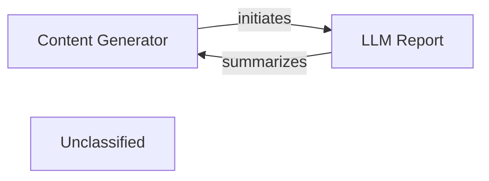

## Details

The `pipelex` system orchestrates content generation pipelines, primarily focusing on LLM, image generation, and OCR tasks. At its core, the system leverages a `Content Generator` to execute these pipelines, which in turn relies on various job components and workers for specific tasks. The `LLM Report` component is responsible for summarizing the outcomes of LLM-specific pipeline executions, providing insights into their performance and results. The overall architecture emphasizes modularity, allowing for flexible integration of different content generation technologies and robust reporting capabilities.

### Content Generator
This central component is responsible for orchestrating and executing various content generation pipelines, including LLM, image generation, and OCR. It acts as the primary driver for initiating and managing the flow of tasks within the system.

**Related Classes/Methods**:

- <a href="https://github.com/Pipelex/pipelex/blob/mainpipelex/cogt/content_generation/content_generator.py#L37-L278" target="_blank" rel="noopener noreferrer">`pipelex.cogt.content_generation.content_generator.ContentGenerator`:37-278</a>

### LLM Report
This component is dedicated to processing and presenting the results of LLM-based content generation pipelines. It aggregates data related to LLM job execution and generates structured reports, providing insights into the LLM's performance and output.

**Related Classes/Methods**:

- <a href="https://github.com/Pipelex/pipelex/blob/mainpipelex/cogt/llm/llm_report.py" target="_blank" rel="noopener noreferrer">`pipelex.cogt.llm.llm_report.LLMReport`</a>

### Unclassified
Component for all unclassified files and utility functions (Utility functions/External Libraries/Dependencies)

**Related Classes/Methods**: _None_

### [FAQ](https://github.com/CodeBoarding/GeneratedOnBoardings/tree/main?tab=readme-ov-file#faq)
