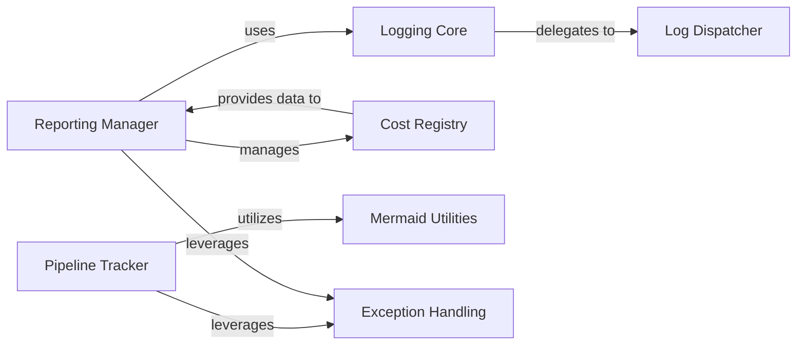

## Details

This subsystem is critical for providing insights into pipeline execution, performance, and costs, thereby aiding in debugging and monitoring of AI workflows. It adheres to the Workflow Orchestration Engine / AI Workflow Framework patterns by centralizing monitoring and reporting functionalities, which are essential for managing complex, long-running processes.

### Pipeline Tracker
Responsible for monitoring and recording the execution flow, state, and key metrics of individual pipelines and their constituent pipes. It provides the raw data necessary for understanding pipeline behavior and identifying bottlenecks.

**Related Classes/Methods**:

- `pipelex.reporting.tracker.PipelineTracker` (1:1)

### Reporting Manager
Aggregates and processes data collected from various sources (like the Pipeline Tracker and Cost Registry) to generate comprehensive reports on pipeline performance, costs, and overall operational health. It acts as the central hub for report generation.

**Related Classes/Methods**:

- `pipelex.reporting.manager.ReportingManager` (1:1)

### Logging Core
Provides the foundational logging infrastructure for the entire system, centralizing the collection of events, warnings, and errors from various components. It ensures a consistent logging standard across the observability subsystem.

**Related Classes/Methods**:

- `pipelex.logging.core.LoggingCore` (1:1)

### Log Dispatcher
Handles the routing and distribution of log messages received from the Logging Core to various output destinations, such as console, files, or external monitoring systems. It ensures logs are delivered efficiently to where they are needed.

**Related Classes/Methods**:

- `pipelex.logging.dispatcher.LogDispatcher` (1:1)

### Cost Registry
Maintains a dedicated registry for tracking and registering costs associated with pipeline execution, particularly for resource-intensive operations like LLM API calls. This component is crucial for cost analysis and optimization.

**Related Classes/Methods**:

- `pipelex.reporting.cost_registry.CostRegistry` (1:1)

### Mermaid Utilities
Offers utility functions specifically designed to generate Mermaid syntax, enabling the creation of visual diagrams (e.g., flowcharts) that represent pipeline structures and execution flows, aiding in visual debugging and understanding.

**Related Classes/Methods**:

- `pipelex.reporting.mermaid.MermaidUtilities` (1:1)

### Exception Handling
Provides a centralized and consistent mechanism for catching, processing, and reporting exceptions across the system. Within the observability context, it ensures that errors are properly logged and can be integrated into reports for debugging and monitoring.

**Related Classes/Methods**:

- `pipelex.common.exception_handling.ExceptionHandling` (1:1)

### [FAQ](https://github.com/CodeBoarding/GeneratedOnBoardings/tree/main?tab=readme-ov-file#faq)
