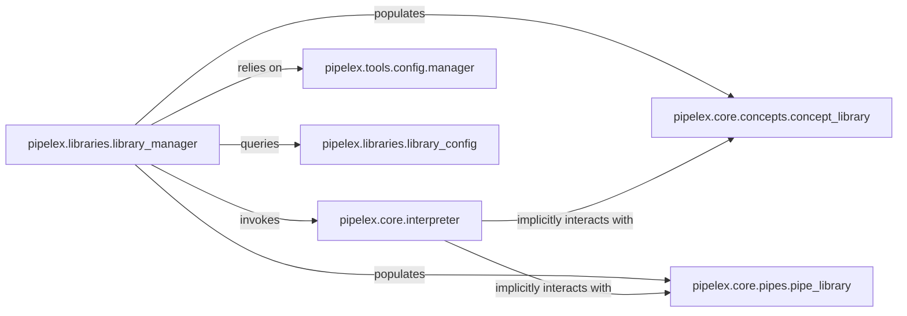

## Details

This subsystem is responsible for the core interpretation of the Pipelex Domain-Specific Language (PLX) for defining pipelines and concepts. It also acts as the central repository and manager for these definitions and any loaded external libraries, ensuring they are parsed, registered, and made available throughout the system.

### pipelex.core.interpreter
The core engine for the Pipelex DSL. It parses raw PLX content (TOML-based) into structured internal blueprints (representing concepts, pipes, domains) and serializes these internal representations back into PLX strings. It is the primary interface for interacting with the PLX language itself.

**Related Classes/Methods**:

- <a href="https://github.com/Pipelex/pipelex/blob/main/pipelex/core/interpreter.py" target="_blank" rel="noopener noreferrer">`pipelex.core.interpreter`</a>

### pipelex.libraries.library_manager
Orchestrates the discovery, loading, and registration of all Pipelex definitions (concepts, pipes, domains) from various sources. It utilizes configuration to locate PLX files, delegates parsing to the `interpreter`, and then populates the respective concept, pipe, and domain registries.

**Related Classes/Methods**:

- <a href="https://github.com/Pipelex/pipelex/blob/main/pipelex/libraries/library_manager.py" target="_blank" rel="noopener noreferrer">`pipelex.libraries.library_manager`</a>

### pipelex.core.concepts.concept_library
Serves as the central, in-memory registry for all defined "concepts" (data types or knowledge representations) within Pipelex. It provides mechanisms to add new concepts and ensures their availability and consistency across the system.

**Related Classes/Methods**:

- <a href="https://github.com/Pipelex/pipelex/blob/main/pipelex/core/concepts/concept_library.py" target="_blank" rel="noopener noreferrer">`pipelex.core.concepts.concept_library`</a>

### pipelex.core.pipes.pipe_library
Manages the central, in-memory registry of all defined "pipes" (individual steps or complete pipelines) in Pipelex. It allows for the addition of new pipe definitions and makes them available for orchestration and execution.

**Related Classes/Methods**:

- <a href="https://github.com/Pipelex/pipelex/blob/main/pipelex/core/pipes/pipe_library.py" target="_blank" rel="noopener noreferrer">`pipelex.core.pipes.pipe_library`</a>

### pipelex.tools.config.manager
Provides a centralized service for managing and accessing project-wide configuration settings. This includes locating root directories, project names, and general configuration parameters that influence how PLX definitions and libraries are found and loaded.

**Related Classes/Methods**:

- <a href="https://github.com/Pipelex/pipelex/blob/main/pipelex/tools/config/manager.py" target="_blank" rel="noopener noreferrer">`pipelex.tools.config.manager`</a>

### pipelex.libraries.library_config
Specializes in managing paths and configurations specific to different types of Pipelex libraries and assets, such as LLM decks, templates, and plugins. It provides methods to retrieve these specific directory paths.

**Related Classes/Methods**:

- <a href="https://github.com/Pipelex/pipelex/blob/main/pipelex/libraries/library_config.py" target="_blank" rel="noopener noreferrer">`pipelex.libraries.library_config`</a>

### [FAQ](https://github.com/CodeBoarding/GeneratedOnBoardings/tree/main?tab=readme-ov-file#faq)
