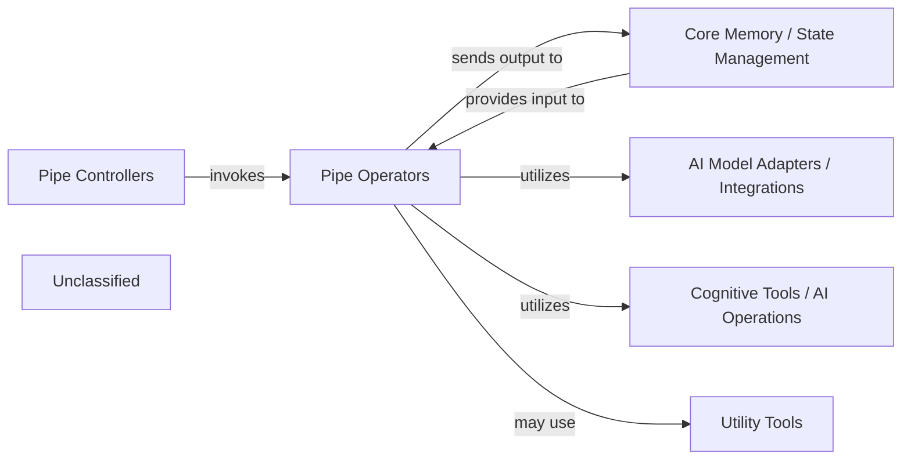

## Details

The `pipelex` project's core subsystem is designed around a flexible pipeline execution model. Pipe Operators define the atomic units of work, interacting with Core Memory / State Management for data. Pipe Controllers orchestrate execution, managing flow. AI Model Adapters / Integrations and Cognitive Tools / AI Operations provide specialized AI capabilities to Pipe Operators. Utility Tools offer general services like configuration. This architecture promotes modularity for easy extension and adaptation.

### Pipe Operators
This component encapsulates the specific operational logic for individual steps (pipes) within a pipeline. It includes the core definitions and interfaces for pipes, as well as their concrete implementations, serving as the atomic units of work. Pipe Operators are responsible for executing tasks such as interacting with AI models, executing custom functions, or performing data transformations, adhering to a clear knowledge-in, knowledge-out contract.

**Related Classes/Methods**:

- <a href="https://github.com/Pipelex/pipelex/blob/mainpipelex/core/pipes/pipe_abstract.py#L16-L94" target="_blank" rel="noopener noreferrer">`pipelex.core.pipes.pipe_abstract.PipeAbstract`:16-94</a>
- <a href="https://github.com/Pipelex/pipelex/blob/mainpipelex/pipe_operators/pipe_operator.py#L19-L102" target="_blank" rel="noopener noreferrer">`pipelex.pipe_operators.pipe_operator.PipeOperator`:19-102</a>
- <a href="https://github.com/Pipelex/pipelex/blob/mainpipelex/pipe_operators/llm/pipe_llm.py" target="_blank" rel="noopener noreferrer">`pipelex.pipe_operators.llm.pipe_llm.LLMPipe`</a>

### Core Memory / State Management
Manages the state and data flow within and between pipeline steps, ensuring consistent access to information. This component is crucial for maintaining context and sharing results across different pipe operations.

**Related Classes/Methods**:

- <a href="https://github.com/Pipelex/pipelex/blob/mainpipelex/core/memory/__init__.py" target="_blank" rel="noopener noreferrer">`pipelex.core.memory`</a>

### AI Model Adapters / Integrations
Provides standardized interfaces and mechanisms for integrating with various external AI models and services. This component abstracts away the complexities of different model APIs, allowing Pipe Operators to interact with AI capabilities uniformly.

**Related Classes/Methods**:

- <a href="https://github.com/Pipelex/pipelex/blob/mainpipelex/cogt/model_backends/__init__.py" target="_blank" rel="noopener noreferrer">`pipelex.cogt.model_backends`</a>
- <a href="https://github.com/Pipelex/pipelex/blob/mainpipelex/plugins/__init__.py" target="_blank" rel="noopener noreferrer">`pipelex.plugins`</a>

### Cognitive Tools / AI Operations
Encapsulates higher-level AI functionalities and cognitive operations, such as Large Language Model (LLM) interactions, image generation, and Optical Character Recognition (OCR). These tools provide specialized AI capabilities that Pipe Operators can leverage.

**Related Classes/Methods**:

- <a href="https://github.com/Pipelex/pipelex/blob/mainpipelex/cogt/llm/__init__.py" target="_blank" rel="noopener noreferrer">`pipelex.cogt.llm`</a>
- <a href="https://github.com/Pipelex/pipelex/blob/mainpipelex/cogt/img_gen/__init__.py" target="_blank" rel="noopener noreferrer">`pipelex.cogt.img_gen`</a>
- <a href="https://github.com/Pipelex/pipelex/blob/mainpipelex/cogt/ocr/__init__.py" target="_blank" rel="noopener noreferrer">`pipelex.cogt.ocr`</a>
- <a href="https://github.com/Pipelex/pipelex/blob/mainpipelex/cogt/content_generation/__init__.py" target="_blank" rel="noopener noreferrer">`pipelex.cogt.content_generation`</a>

### Pipe Controllers
Orchestrates the execution of pipes, managing control flow logic such as sequencing, parallelism, and conditional execution. This component dictates the order and manner in which Pipe Operators are invoked.

**Related Classes/Methods**:

- <a href="https://github.com/Pipelex/pipelex/blob/mainpipelex/pipe_controllers/__init__.py" target="_blank" rel="noopener noreferrer">`pipelex.pipe_controllers`</a>
- `pipelex.pipe_controllers.sequence.sequence_controller.SequenceController`

### Utility Tools
Provides a collection of general-purpose utilities and helper functions used across the system. This includes functionalities like configuration management, secret handling, and templating, supporting various operational needs of other components.

**Related Classes/Methods**:

- <a href="https://github.com/Pipelex/pipelex/blob/mainpipelex/tools/__init__.py" target="_blank" rel="noopener noreferrer">`pipelex.tools`</a>
- `pipelex.tools.config.config_manager.ConfigManager`

### Unclassified
Component for all unclassified files and utility functions (Utility functions/External Libraries/Dependencies)

**Related Classes/Methods**: _None_

### [FAQ](https://github.com/CodeBoarding/GeneratedOnBoardings/tree/main?tab=readme-ov-file#faq)
