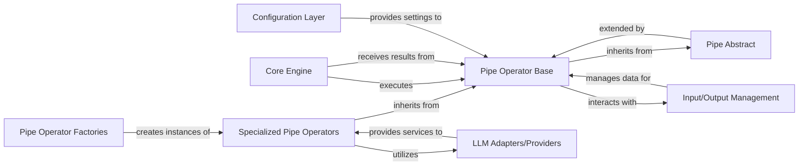

## Details

Abstract Components Overview of the Pipelex system.

### Pipe Operator Base
The abstract base class (pipelex.pipe_operators.pipe_operator) that defines the common interface and core execution logic for all specialized pipe operators. It ensures a standardized contract for how individual operations integrate into a pipeline.

**Related Classes/Methods**:

- `pipelex.pipe_operators.pipe_operator`

### Specialized Pipe Operators
Concrete implementations of the Pipe Operator Base, each designed for a specific task. This includes pipelex.pipe_operators.pipe_llm (for LLM calls), pipelex.pipe_operators.pipe_img_gen (for image generation), pipelex.pipe_operators.pipe_ocr (for OCR), pipelex.pipe_operators.pipe_func (for custom Python functions), and pipelex.pipe_operators.pipe_jinja2 (for templating).

**Related Classes/Methods**:

- `pipelex.pipe_operators.pipe_llm`
- `pipelex.pipe_operators.pipe_img_gen`
- `pipelex.pipe_operators.pipe_ocr`
- `pipelex.pipe_operators.pipe_func`
- `pipelex.pipe_operators.pipe_jinja2`

### Pipe Abstract
The most fundamental abstract base (pipelex.core.pipe_abstract.PipeAbstract) that establishes the absolute minimum interface required for any component to be considered a "pipe" within the Pipelex system. Pipe Operator Base extends this.

**Related Classes/Methods**:

- <a href="https://github.com/CodeBoarding/pipelex/blob/main/pipelex/core/pipe_abstract.py#L13-L81" target="_blank" rel="noopener noreferrer">`pipelex.core.pipe_abstract.PipeAbstract` (13:81)</a>

### Core Engine
The central orchestration component responsible for parsing pipeline definitions, managing the execution flow, and invoking Pipe Operators in the correct sequence (sequential, parallel, conditional).

**Related Classes/Methods**:

- `pipelex.core`

### LLM Adapters/Providers
A set of modules that abstract the complexities of interacting with various Large Language Model services (e.g., Anthropic, Google, Mistral AI). They provide a consistent API for PipeLLM to consume.

**Related Classes/Methods**:

- `pipelex.llms`

### Input/Output Management
Handles the standardized flow of data into and out of individual Pipe Operators, ensuring data consistency, type validation, and proper transfer between pipeline stages.

**Related Classes/Methods**:

- `pipelex.io`

### Pipe Operator Factories
Responsible for dynamically creating instances of Specialized Pipe Operators at runtime, typically based on declarative workflow definitions (e.g., TOML files) and associated blueprints.

**Related Classes/Methods**:

- `pipelex.factories`

### Configuration Layer
Manages and provides system-wide and pipeline-specific configuration settings, which influence the behavior and parameters of Pipe Operators during their instantiation and execution.

**Related Classes/Methods**:

- `pipelex.config`

### [FAQ](https://github.com/CodeBoarding/GeneratedOnBoardings/tree/main?tab=readme-ov-file#faq)
