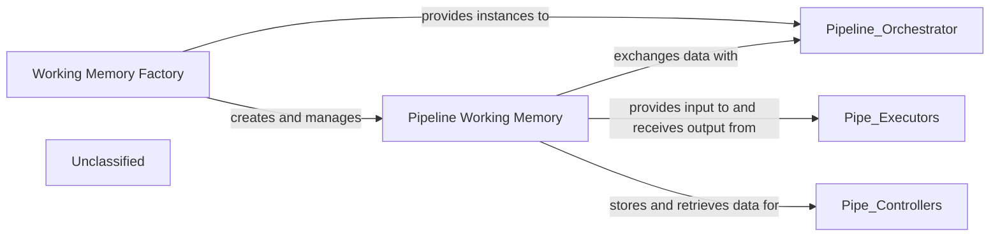

## Details

The memory subsystem in `pipelex.core.memory` is foundational for managing data within AI pipelines. It consists of two primary components: the `Pipeline Working Memory` and the `Working Memory Factory`. The `Working Memory Factory` is responsible for creating and initializing instances of the `Pipeline Working Memory`, which then serves as the central, ephemeral data store for the entire pipeline execution. This `Pipeline Working Memory` facilitates data exchange and state management by allowing components like the `Pipeline Orchestrator`, `Pipe Executors`, and `Pipe Controllers` to store, retrieve, and manipulate data artifacts throughout the pipeline's lifecycle. This clear separation of concerns ensures efficient data handling and flexible pipeline execution.

### Pipeline Working Memory
This component, represented by the `pipelex.core.memory.WorkingMemory` class, serves as the central, ephemeral data store for a running pipeline. It is responsible for holding, managing, and providing access to all data artifacts ("stuffs") that flow between different stages of a pipeline. It ensures data continuity, facilitates data exchange, and maintains the overall state and context of the pipeline execution, which is crucial for stateful AI workflows. It offers methods for adding, retrieving, and manipulating these data artifacts, including support for aliases and various content types.

**Related Classes/Methods**:

- <a href="https://github.com/Pipelex/pipelex/blob/mainpipelex/core/memory/working_memory.py#L37-L295" target="_blank" rel="noopener noreferrer">`pipelex.core.memory.WorkingMemory`:37-295</a>

### Working Memory Factory
This component, implemented by the `pipelex.core.memory.WorkingMemoryFactory` class, is dedicated to the creation and management of `Pipeline Working Memory` instances. It provides various static methods to instantiate `WorkingMemory` objects from diverse sources, such as raw text, images, PDFs, lists of "stuffs," or compact memory representations. It abstracts the complex instantiation logic, ensuring that new, properly initialized working memory instances are available for each pipeline run, and can also generate mock memory for dry-run scenarios.

**Related Classes/Methods**:

- <a href="https://github.com/Pipelex/pipelex/blob/mainpipelex/core/memory/working_memory_factory.py#L20-L248" target="_blank" rel="noopener noreferrer">`pipelex.core.memory.WorkingMemoryFactory`:20-248</a>

### Unclassified
Component for all unclassified files and utility functions (Utility functions/External Libraries/Dependencies)

**Related Classes/Methods**: _None_

### [FAQ](https://github.com/CodeBoarding/GeneratedOnBoardings/tree/main?tab=readme-ov-file#faq)
