```mermaid
graph LR
    pipelex_libraries_library_manager["pipelex.libraries.library_manager"]
    pipelex_core_interpreter["pipelex.core.interpreter"]
    pipelex_core_pipes_pipe_library["pipelex.core.pipes.pipe_library"]
    pipelex_core_pipes_pipe_factory["pipelex.core.pipes.pipe_factory"]
    pipelex_core_pipes_pipe_input_spec["pipelex.core.pipes.pipe_input_spec"]
    pipelex_core_concepts_concept_library["pipelex.core.concepts.concept_library"]
    pipelex_core_concepts_concept_blueprint["pipelex.core.concepts.concept_blueprint"]
    pipelex_core_domains_domain_library["pipelex.core.domains.domain_library"]
    pipelex_libraries_library_manager -- "invokes" --> pipelex_core_interpreter
    pipelex_libraries_library_manager -- "populates" --> pipelex_core_pipes_pipe_library
    pipelex_libraries_library_manager -- "populates" --> pipelex_core_concepts_concept_library
    pipelex_libraries_library_manager -- "populates" --> pipelex_core_domains_domain_library
    pipelex_core_interpreter -- "generates blueprints for" --> pipelex_core_pipes_pipe_factory
    pipelex_core_interpreter -- "processes" --> pipelex_core_pipes_pipe_input_spec
    pipelex_core_pipes_pipe_library -- "references" --> pipelex_core_pipes_pipe_input_spec
    pipelex_core_pipes_pipe_factory -- "constructs objects for" --> pipelex_core_pipes_pipe_library
    pipelex_core_pipes_pipe_input_spec -- "defines input schema for" --> pipelex_core_pipes_pipe_library
    pipelex_core_concepts_concept_library -- "manages" --> pipelex_core_concepts_concept_blueprint
    pipelex_core_domains_domain_library -- "organizes" --> pipelex_core_concepts_concept_library
```

## Details

The `Pipeline Definition & Data Schema` subsystem is responsible for managing the declarative definition of pipelines and the underlying data structures that define the data flowing through them. It translates external blueprints into executable internal representations.

### pipelex.libraries.library_manager
Orchestrates the loading and registration of all pipeline-related definitions (pipes, concepts, domains) from external sources (e.g., TOML files) into their respective in-memory libraries. It acts as the primary entry point for external configuration.

**Related Classes/Methods**:

- <a href="https://github.com/Pipelex/pipelex/blob/main/pipelex/libraries/library_manager.py" target="_blank" rel="noopener noreferrer">`pipelex.libraries.library_manager`</a>

### pipelex.core.interpreter
Translates declarative TOML pipeline and concept blueprints into internal structured data representations. It is the core parser for the system's declarative configuration, converting human-readable definitions into a format the system can understand.

**Related Classes/Methods**:

- <a href="https://github.com/Pipelex/pipelex/blob/main/pipelex/core/interpreter.py" target="_blank" rel="noopener noreferrer">`pipelex.core.interpreter`</a>

### pipelex.core.pipes.pipe_library
Acts as a central registry for all available `Pipe` definitions, allowing for storage, retrieval, and validation of pipe blueprints. It ensures that all defined pipes are consistently managed and accessible.

**Related Classes/Methods**:

- <a href="https://github.com/Pipelex/pipelex/blob/main/pipelex/core/pipes/pipe_library.py" target="_blank" rel="noopener noreferrer">`pipelex.core.pipes.pipe_library`</a>

### pipelex.core.pipes.pipe_factory
Constructs concrete `Pipe` objects from their blueprint definitions, ensuring correct instantiation based on the parsed declarative structure. It bridges the gap between a declarative definition and an executable object.

**Related Classes/Methods**:

- <a href="https://github.com/Pipelex/pipelex/blob/main/pipelex/core/pipes/pipe_factory.py" target="_blank" rel="noopener noreferrer">`pipelex.core.pipes.pipe_factory`</a>

### pipelex.core.pipes.pipe_input_spec
Defines the expected input schema for a pipe, including required concept codes and validation rules. It ensures data consistency and type safety within the pipeline by specifying what a pipe expects to receive.

**Related Classes/Methods**:

- <a href="https://github.com/Pipelex/pipelex/blob/main/pipelex/core/pipes/pipe_input_spec.py" target="_blank" rel="noopener noreferrer">`pipelex.core.pipes.pipe_input_spec`</a>

### pipelex.core.concepts.concept_library
Manages a collection of all defined data concepts, providing mechanisms for adding, retrieving, and validating them. It ensures a consistent understanding of data types and structures across the system.

**Related Classes/Methods**:

- <a href="https://github.com/Pipelex/pipelex/blob/main/pipelex/core/concepts/concept_library.py" target="_blank" rel="noopener noreferrer">`pipelex.core.concepts.concept_library`</a>

### pipelex.core.concepts.concept_blueprint
Defines the declarative structure and validation rules for a data concept, serving as the template for creating `Concept` objects. It is the actual schema definition for data concepts.

**Related Classes/Methods**:

- <a href="https://github.com/Pipelex/pipelex/blob/main/pipelex/core/concepts/concept_blueprint.py" target="_blank" rel="noopener noreferrer">`pipelex.core.concepts.concept_blueprint`</a>

### pipelex.core.domains.domain_library
Manages a collection of defined data domains, which categorize and organize concepts, providing a hierarchical structure for data organization. This helps in structuring and managing a large number of concepts.

**Related Classes/Methods**:

- <a href="https://github.com/Pipelex/pipelex/blob/main/pipelex/core/domains/domain_library.py" target="_blank" rel="noopener noreferrer">`pipelex.core.domains.domain_library`</a>

### [FAQ](https://github.com/CodeBoarding/GeneratedOnBoardings/tree/main?tab=readme-ov-file#faq)
