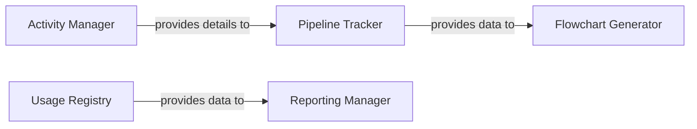

## Details

The Pipeline Observability & Reporting subsystem encompasses core components responsible for monitoring, tracking, and reporting on pipeline execution and resource usage.

### Pipeline Tracker
Manages the structural definition and runtime tracking of the pipeline. It records pipeline steps, their interconnections, and execution flow, forming a graph representation of the workflow. It also handles the setup and teardown of tracking sessions. This component is fundamental for understanding the dynamic behavior and structure of any executed pipeline.

**Related Classes/Methods**:

- <a href="https://github.com/Pipelex/pipelex/blob/main/pipelex/pipeline/track/pipeline_tracker.py" target="_blank" rel="noopener noreferrer">`pipelex.pipeline.track.pipeline_tracker`</a>

### Flowchart Generator
Visualizes the pipeline structure. It takes tracked pipeline data from the Pipeline Tracker and generates Mermaid flowchart code, including subgraphs and properly tagged edges, to provide a clear graphical representation of the workflow for analysis and debugging. This is crucial for human-readable insights into complex workflows.

**Related Classes/Methods**:

- <a href="https://github.com/Pipelex/pipelex/blob/main/pipelex/pipeline/track/flow_chart.py" target="_blank" rel="noopener noreferrer">`pipelex.pipeline.track.flow_chart`</a>

### Activity Manager
Manages the lifecycle of individual pipeline activities. It handles the setup and teardown phases for activities, orchestrating how individual activity outputs and states are managed during pipeline execution. This component ensures that each step within the pipeline is properly observed and its state is available for tracking.

**Related Classes/Methods**:

- <a href="https://github.com/Pipelex/pipelex/blob/main/pipelex/pipeline/activity/activity_manager.py" target="_blank" rel="noopener noreferrer">`pipelex.pipeline.activity.activity_manager`</a>

### Reporting Manager
Collects, aggregates, and generates comprehensive reports on pipeline usage metrics, with a particular focus on LLM (Large Language Model) job costs, such as token usage. This component is vital for operational insights, cost analysis, and performance monitoring in AI/ML workflows.

**Related Classes/Methods**:

- <a href="https://github.com/Pipelex/pipelex/blob/main/pipelex/reporting/reporting_manager.py" target="_blank" rel="noopener noreferrer">`pipelex.reporting.reporting_manager`</a>

### Usage Registry
Serves as a dedicated data store for recording and managing usage statistics, primarily token consumption for LLM inference jobs. It acts as the backend for the Reporting Manager, providing a persistent and queryable source of truth for resource utilization.

**Related Classes/Methods**:

- <a href="https://github.com/Pipelex/pipelex/blob/main/pipelex/reporting/reporting_manager.py#L20-L27" target="_blank" rel="noopener noreferrer">`pipelex.reporting.reporting_manager.UsageRegistry`:20-27</a>

### [FAQ](https://github.com/CodeBoarding/GeneratedOnBoardings/tree/main?tab=readme-ov-file#faq)
