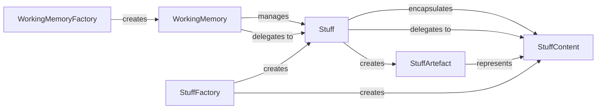

## Details

The `pipelex` core memory and data artifact subsystem is designed around the `WorkingMemory` component, which serves as the central, transient store for all data artifacts, represented by `Stuff` objects. `WorkingMemoryFactory` is responsible for initializing `WorkingMemory` instances. Each `Stuff` object encapsulates `StuffContent`, which holds the raw data and handles type-specific operations, including rendering. `StuffFactory` facilitates the creation of `Stuff` and `StuffContent` from various inputs. For rendering purposes, `Stuff` can create a `StuffArtefact` from its `StuffContent`, providing a specialized, renderable view suitable for templating engines. This architecture ensures a clear separation of concerns, with dedicated components for data storage, content encapsulation, rendering representation, and object creation.

### WorkingMemory
The central, transient store for all data artifacts (`Stuff` objects) during pipeline execution. It manages the lifecycle of these artifacts, including adding, retrieving, updating, and aliasing, ensuring data availability and integrity across pipeline steps.

**Related Classes/Methods**:

- <a href="https://github.com/Pipelex/pipelex/blob/main/pipelex/core/memory/working_memory.py#L37-L344" target="_blank" rel="noopener noreferrer">`pipelex.core.memory.working_memory.WorkingMemory`:37-344</a>

### Stuff
Represents a single, unified data artifact within the pipeline, encapsulating `StuffContent`. It provides a consistent interface for accessing and validating content, abstracting underlying data types to fulfill the "knowledge-in, knowledge-out" contract of the pipeline.

**Related Classes/Methods**:

- <a href="https://github.com/Pipelex/pipelex/blob/main/pipelex/core/stuffs/stuff.py#L26-L194" target="_blank" rel="noopener noreferrer">`pipelex.core.stuffs.stuff.Stuff`:26-194</a>

### StuffContent
Holds the raw data of a `Stuff` object and handles type-specific operations. It is responsible for rendering content into various output formats (e.g., HTML, JSON, plain text, Markdown) and supports content creation from basic types, performing the actual data validation and manipulation.

**Related Classes/Methods**:

- <a href="https://github.com/Pipelex/pipelex/blob/main/pipelex/core/stuffs/stuff_content.py#L30-L70" target="_blank" rel="noopener noreferrer">`pipelex.core.stuffs.stuff_content.StuffContent`:30-70</a>

### StuffArtefact
Provides a specialized, renderable view of `StuffContent`, primarily focused on rendering tagged content for templating engines (e.g., Jinja2). It facilitates the extraction and presentation of content in a format suitable for dynamic generation within the pipeline.

**Related Classes/Methods**:

- <a href="https://github.com/Pipelex/pipelex/blob/main/pipelex/core/stuffs/stuff_artefact.py#L13-L60" target="_blank" rel="noopener noreferrer">`pipelex.core.stuffs.stuff_artefact.StuffArtefact`:13-60</a>

### WorkingMemoryFactory
Manages the creation and initialization of `WorkingMemory` instances. It can construct `WorkingMemory` from various initial states, such as pre-existing data (text, image, PDF), compact memory representations, or for specific operational modes like dry runs.

**Related Classes/Methods**:

- <a href="https://github.com/Pipelex/pipelex/blob/main/pipelex/core/memory/working_memory_factory.py#L20-L248" target="_blank" rel="noopener noreferrer">`pipelex.core.memory.working_memory_factory.WorkingMemoryFactory`:20-248</a>

### StuffFactory
Handles the creation of `Stuff` and `StuffContent` objects from diverse inputs, including raw strings, concept definitions, blueprints, or by combining existing `Stuff` instances. It also manages error conditions that may arise during the creation process.

**Related Classes/Methods**:

- <a href="https://github.com/Pipelex/pipelex/blob/main/pipelex/core/stuffs/stuff_factory.py#L38-L259" target="_blank" rel="noopener noreferrer">`pipelex.core.stuffs.stuff_factory.StuffFactory`:38-259</a>

### [FAQ](https://github.com/CodeBoarding/GeneratedOnBoardings/tree/main?tab=readme-ov-file#faq)
