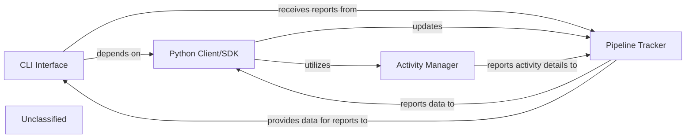

## Details

The Pipelex system provides both a command-line interface (CLI) and a Python SDK for managing data pipelines. The `CLI Interface` leverages the `Python Client/SDK` for core operations and receives status reports from the `Pipeline Tracker`. The `Python Client/SDK` is the primary programmatic interface, allowing users to define, update, and monitor pipelines. It interacts with the `Pipeline Tracker` to update pipeline definitions and receive execution data, and directly utilizes the `Activity Manager` for granular control over pipeline steps. The `Pipeline Tracker` is central to managing pipeline lifecycles, status, and historical data, receiving detailed activity reports from the `Activity Manager` and providing overall pipeline status to both the `Python Client/SDK` and the `CLI Interface`. The `Activity Manager` is responsible for overseeing individual pipeline steps, providing granular execution details to the `Pipeline Tracker`.

### CLI Interface
Provides a user-friendly command-line interface for common Pipelex operations (e.g., `run`, `validate`, `status`). It acts as the entry point for command-line users by parsing commands and delegating to the core system.

**Related Classes/Methods**:

- <a href="https://github.com/Pipelex/pipelex/blob/main/pipelex/cli/__init__.py" target="_blank" rel="noopener noreferrer">`pipelex.cli`</a>

### Python Client/SDK
Offers a comprehensive Python API for developers to integrate Pipelex into their applications. It allows programmatic control over pipeline creation, execution, and monitoring, serving as a high-level API for defining and managing pipelines.

**Related Classes/Methods**:

- <a href="https://github.com/Pipelex/pipelex/blob/main/pipelex/client" target="_blank" rel="noopener noreferrer">`pipelex.client`</a>

### Pipeline Tracker
Manages the lifecycle, status, and historical data of pipeline runs, including their structural definitions. It provides mechanisms for reporting and visualization of pipeline execution.

**Related Classes/Methods**:

- <a href="https://github.com/Pipelex/pipelex/blob/main/pipelex/pipeline/track/__init__.py" target="_blank" rel="noopener noreferrer">`pipelex.pipeline.track`</a>

### Activity Manager
Oversees and manages the individual steps or "activities" within a pipeline, including their input, output, and execution status. It provides granular details of pipeline execution.

**Related Classes/Methods**:

- <a href="https://github.com/Pipelex/pipelex/blob/main/pipelex/pipeline/activity/__init__.py" target="_blank" rel="noopener noreferrer">`pipelex.pipeline.activity`</a>

### Unclassified
Component for all unclassified files and utility functions (Utility functions/External Libraries/Dependencies)

**Related Classes/Methods**: _None_

### [FAQ](https://github.com/CodeBoarding/GeneratedOnBoardings/tree/main?tab=readme-ov-file#faq)
