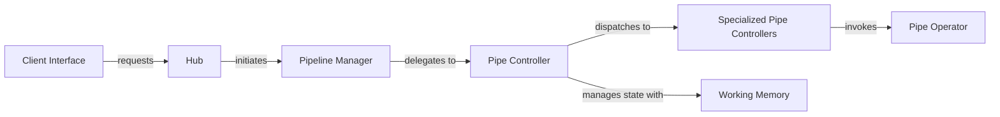

## Details

The `pipelex` system is designed around a robust pipeline orchestration architecture. External clients interact via the `Client Interface`, which leverages the `Hub` to provision and manage `Pipeline Manager` instances. The `Pipeline Manager` orchestrates the high-level execution flow, delegating the detailed control of pipeline segments to the `Pipe Controller`. The `Pipe Controller` then dispatches to various `Specialized Pipe Controllers` (Sequence, Condition, Parallel, Batch) to implement specific control flow patterns. Throughout this process, `Working Memory` provides the necessary state and data context. The actual processing tasks are performed by `Pipe Operator` components, which are invoked by the `Specialized Pipe Controllers`, ensuring a clear separation of concerns between control flow and operational logic.

### Pipeline Manager
Acts as the primary orchestrator, managing the overall lifecycle and execution flow of a pipeline from initiation to completion. It translates the high-level pipeline definition into executable steps. This component is crucial as the entry point for pipeline execution, embodying the "Orchestration" pattern.

**Related Classes/Methods**:

- <a href="https://github.com/Pipelex/pipelex/blob/main/pipelex/pipeline/pipeline_manager.py" target="_blank" rel="noopener noreferrer">`pipelex.pipeline.pipeline_manager`</a>

### Pipe Controller
Serves as a central dispatcher that routes execution to specific pipe control strategies. It manages the state and data flow for a segment of the pipeline, ensuring proper context and data exchange. This component is central to implementing the "Workflow Orchestrator" aspect, directing the flow based on pipeline structure.

**Related Classes/Methods**:

- <a href="https://github.com/Pipelex/pipelex/blob/main/pipelex/pipe_controllers/pipe_controller.py" target="_blank" rel="noopener noreferrer">`pipelex.pipe_controllers.pipe_controller`</a>

### Specialized Pipe Controllers
A group of specialized controllers (Sequence, Condition, Parallel, Batch) that implement specific control flow logic for executing pipes. They are dispatched by the `Pipe Controller` based on the pipeline's structure, handling sequential, conditional, parallel, or batch processing of pipes.

**Related Classes/Methods**:

- <a href="https://github.com/Pipelex/pipelex/blob/main/" target="_blank" rel="noopener noreferrer">`pipelex.pipe_controllers.sequence.pipe_sequence`</a>
- <a href="https://github.com/Pipelex/pipelex/blob/main/" target="_blank" rel="noopener noreferrer">`pipelex.pipe_controllers.condition.pipe_condition`</a>
- <a href="https://github.com/Pipelex/pipelex/blob/main/" target="_blank" rel="noopener noreferrer">`pipelex.pipe_controllers.parallel.pipe_parallel`</a>
- <a href="https://github.com/Pipelex/pipelex/blob/main/" target="_blank" rel="noopener noreferrer">`pipelex.pipe_controllers.batch.pipe_batch`</a>

### Client Interface
Provides the external interface for interacting with the `pipelex` system, allowing users or other services to request and manage pipeline executions. It acts as the entry point for initiating pipeline operations.

**Related Classes/Methods**:

- <a href="https://github.com/Pipelex/pipelex/blob/main/pipelex/client/client.py" target="_blank" rel="noopener noreferrer">`pipelex.client.client.Client`</a>

### Working Memory [[Expand]](./Working_Memory.md)
A central repository for storing and retrieving the current state, data, and context relevant to an ongoing pipeline execution. It ensures that all components have access to the necessary information at each step.

**Related Classes/Methods**:

- <a href="https://github.com/Pipelex/pipelex/blob/main/pipelex/core/memory/working_memory.py#L37-L344" target="_blank" rel="noopener noreferrer">`pipelex.core.memory.working_memory.WorkingMemory`:37-344</a>

### Pipe Operator
Encapsulates the atomic processing logic for a single step within a pipeline. Each operator performs a specific task, such as data transformation, external API calls, or AI model inference.

**Related Classes/Methods**:

- <a href="https://github.com/Pipelex/pipelex/blob/main/pipelex/pipe_operators/pipe_operator.py#L16-L90" target="_blank" rel="noopener noreferrer">`pipelex.pipe_operators.pipe_operator.PipeOperator`:16-90</a>

### Hub
Acts as a central registry and factory for pipeline-related services. It is responsible for providing access to and initiating core pipeline components, such as the `Pipeline Manager`, based on client requests.

**Related Classes/Methods**:

- <a href="https://github.com/Pipelex/pipelex/blob/main/" target="_blank" rel="noopener noreferrer">`pipelex.hub.Hub`</a>

### [FAQ](https://github.com/CodeBoarding/GeneratedOnBoardings/tree/main?tab=readme-ov-file#faq)
