```mermaid
graph LR
    Pipelex_Client_CLI_SDK_["Pipelex Client (CLI/SDK)"]
    Core_Pipeline_Orchestrator["Core Pipeline Orchestrator"]
    PLX_Definition_Registry["PLX Definition & Registry"]
    Runtime_Data_State["Runtime Data & State"]
    AI_Service_Abstraction["AI Service Abstraction"]
    Templating_Engine["Templating Engine"]
    Reporting_Monitoring["Reporting & Monitoring"]
    Pipelex_Client_CLI_SDK_ -- "Initiates Pipeline Execution" --> Core_Pipeline_Orchestrator
    Pipelex_Client_CLI_SDK_ -- "Manages Pipeline Lifecycle" --> Core_Pipeline_Orchestrator
    Pipelex_Client_CLI_SDK_ -- "Configures Definitions" --> PLX_Definition_Registry
    Pipelex_Client_CLI_SDK_ -- "Loads Libraries" --> PLX_Definition_Registry
    Core_Pipeline_Orchestrator -- "Retrieves Pipeline Blueprints" --> PLX_Definition_Registry
    Core_Pipeline_Orchestrator -- "Accesses Concept Definitions" --> PLX_Definition_Registry
    Core_Pipeline_Orchestrator -- "Stores/Retrieves Data Artifacts" --> Runtime_Data_State
    Core_Pipeline_Orchestrator -- "Manages Working Memory" --> Runtime_Data_State
    Core_Pipeline_Orchestrator -- "Delegates AI Tasks" --> AI_Service_Abstraction
    Core_Pipeline_Orchestrator -- "Invokes AI Workers" --> AI_Service_Abstraction
    Core_Pipeline_Orchestrator -- "Renders Dynamic Content" --> Templating_Engine
    Core_Pipeline_Orchestrator -- "Formats Prompts/Outputs" --> Templating_Engine
    Core_Pipeline_Orchestrator -- "Reports Execution Status" --> Reporting_Monitoring
    Core_Pipeline_Orchestrator -- "Logs Activities" --> Reporting_Monitoring
    PLX_Definition_Registry -- "Provides Data Schemas (Concepts) for Validation" --> Runtime_Data_State
    AI_Service_Abstraction -- "Processes Input Data" --> Runtime_Data_State
    AI_Service_Abstraction -- "Stores Output Data" --> Runtime_Data_State
    AI_Service_Abstraction -- "Accesses LLM Deck Configurations" --> PLX_Definition_Registry
    AI_Service_Abstraction -- "Retrieves AI Worker Definitions" --> PLX_Definition_Registry
    Reporting_Monitoring -- "Collects Data for Reports" --> Runtime_Data_State
    Reporting_Monitoring -- "Tracks Data Flow" --> Runtime_Data_State
    Reporting_Monitoring -- "Gathers Inference Metrics" --> AI_Service_Abstraction
    Reporting_Monitoring -- "Logs AI Service Usage" --> AI_Service_Abstraction
    click Pipelex_Client_CLI_SDK_ href "https://github.com/Pipelex/pipelex/blob/main/.codeboarding/Pipelex_Client_CLI_SDK_.md" "Details"
    click Core_Pipeline_Orchestrator href "https://github.com/Pipelex/pipelex/blob/main/.codeboarding/Core_Pipeline_Orchestrator.md" "Details"
    click PLX_Definition_Registry href "https://github.com/Pipelex/pipelex/blob/main/.codeboarding/PLX_Definition_Registry.md" "Details"
    click Runtime_Data_State href "https://github.com/Pipelex/pipelex/blob/main/.codeboarding/Runtime_Data_State.md" "Details"
    click AI_Service_Abstraction href "https://github.com/Pipelex/pipelex/blob/main/.codeboarding/AI_Service_Abstraction.md" "Details"
    click Templating_Engine href "https://github.com/Pipelex/pipelex/blob/main/.codeboarding/Templating_Engine.md" "Details"
    click Reporting_Monitoring href "https://github.com/Pipelex/pipelex/blob/main/.codeboarding/Reporting_Monitoring.md" "Details"
```

## Details

Pipelex is an AI workflow orchestration library centered around a declarative Domain-Specific Language (PLX). The `Pipelex Client` serves as the user's entry point, initiating workflows managed by the `Core Pipeline Orchestrator`. This orchestrator interprets pipeline definitions from the `PLX Definition & Registry`, which also manages loaded libraries and concept schemas. During execution, the `Core Pipeline Orchestrator` interacts with `Runtime Data & State` to manage all transient data artifacts ("stuffs"). AI-specific tasks are delegated to the `AI Service Abstraction` layer, which integrates various AI workers and external providers. Dynamic content generation within pipes is handled by the `Templating Engine`, while `Reporting & Monitoring` provides comprehensive insights into pipeline execution and resource usage. This modular design emphasizes clear separation of concerns, enabling flexible and extensible AI workflow automation.

### Pipelex Client (CLI/SDK) [[Expand]](./Pipelex_Client_CLI_SDK_.md)
The primary external interface for users to interact with Pipelex, enabling programmatic control or command-line operations.

**Related Classes/Methods**:

- <a href="https://github.com/Pipelex/pipelex/blob/main/pipelex/cli/" target="_blank" rel="noopener noreferrer">`pipelex.cli`</a>
- <a href="https://github.com/Pipelex/pipelex/blob/main/pipelex/client/" target="_blank" rel="noopener noreferrer">`pipelex.client`</a>

### Core Pipeline Orchestrator [[Expand]](./Core_Pipeline_Orchestrator.md)
The central nervous system of Pipelex, responsible for setting up the environment, managing the lifecycle of pipelines, and coordinating the execution of individual pipes.

**Related Classes/Methods**:

- <a href="https://github.com/Pipelex/pipelex/blob/main/pipelex/pipelex.py#L61-L305" target="_blank" rel="noopener noreferrer">`pipelex.pipelex`:61-305</a>
- <a href="https://github.com/Pipelex/pipelex/blob/main/pipelex/hub.py" target="_blank" rel="noopener noreferrer">`pipelex.hub`</a>
- <a href="https://github.com/Pipelex/pipelex/blob/main/pipelex/pipeline/pipeline_manager.py" target="_blank" rel="noopener noreferrer">`pipelex.pipeline.pipeline_manager`</a>
- <a href="https://github.com/Pipelex/pipelex/blob/main/pipelex/pipe_controllers/" target="_blank" rel="noopener noreferrer">`pipelex.pipe_controllers`</a>
- <a href="https://github.com/Pipelex/pipelex/blob/main/pipelex/pipe_works/pipe_router.py" target="_blank" rel="noopener noreferrer">`pipelex.pipe_works.pipe_router`</a>

### PLX Definition & Registry [[Expand]](./PLX_Definition_Registry.md)
Manages the interpretation of the Pipelex DSL (PLX) for defining pipelines and concepts, and serves as the central repository for these definitions and loaded libraries.

**Related Classes/Methods**:

- <a href="https://github.com/Pipelex/pipelex/blob/main/pipelex/core/interpreter.py" target="_blank" rel="noopener noreferrer">`pipelex.core.interpreter`</a>
- <a href="https://github.com/Pipelex/pipelex/blob/main/pipelex/libraries/" target="_blank" rel="noopener noreferrer">`pipelex.libraries`</a>
- <a href="https://github.com/Pipelex/pipelex/blob/main/pipelex/tools/config/manager.py" target="_blank" rel="noopener noreferrer">`pipelex.tools.config.manager`</a>
- <a href="https://github.com/Pipelex/pipelex/blob/main/pipelex/core/concepts/" target="_blank" rel="noopener noreferrer">`pipelex.core.concepts`</a>
- <a href="https://github.com/Pipelex/pipelex/blob/main/pipelex/core/pipes/" target="_blank" rel="noopener noreferrer">`pipelex.core.pipes`</a>

### Runtime Data & State [[Expand]](./Runtime_Data_State.md)
Handles the transient storage and manipulation of all data artifacts ("stuffs") that are produced and consumed during a pipeline's execution, ensuring data integrity and type validation.

**Related Classes/Methods**:

- <a href="https://github.com/Pipelex/pipelex/blob/main/pipelex/core/memory/working_memory.py" target="_blank" rel="noopener noreferrer">`pipelex.core.memory.working_memory`</a>
- <a href="https://github.com/Pipelex/pipelex/blob/main/pipelex/core/stuffs/" target="_blank" rel="noopener noreferrer">`pipelex.core.stuffs`</a>

### AI Service Abstraction [[Expand]](./AI_Service_Abstraction.md)
A unified component for managing and providing access to various AI workers (LLM, Image Generation, OCR) and adapting to different third-party AI services via plugins.

**Related Classes/Methods**:

- <a href="https://github.com/Pipelex/pipelex/blob/main/pipelex/cogt/inference/inference_manager.py" target="_blank" rel="noopener noreferrer">`pipelex.cogt.inference.inference_manager`</a>
- <a href="https://github.com/Pipelex/pipelex/blob/main/pipelex/cogt/llm/" target="_blank" rel="noopener noreferrer">`pipelex.cogt.llm`</a>
- <a href="https://github.com/Pipelex/pipelex/blob/main/pipelex/cogt/imgg/" target="_blank" rel="noopener noreferrer">`pipelex.cogt.imgg`</a>
- <a href="https://github.com/Pipelex/pipelex/blob/main/pipelex/cogt/ocr/" target="_blank" rel="noopener noreferrer">`pipelex.cogt.ocr`</a>
- <a href="https://github.com/Pipelex/pipelex/blob/main/pipelex/pipe_operators/llm/pipe_llm.py" target="_blank" rel="noopener noreferrer">`pipelex.pipe_operators.llm.pipe_llm`</a>
- <a href="https://github.com/Pipelex/pipelex/blob/main/pipelex/pipe_operators/img_gen/pipe_img_gen.py" target="_blank" rel="noopener noreferrer">`pipelex.pipe_operators.img_gen.pipe_img_gen`</a>
- <a href="https://github.com/Pipelex/pipelex/blob/main/pipelex/pipe_operators/ocr/pipe_ocr.py" target="_blank" rel="noopener noreferrer">`pipelex.pipe_operators.ocr.pipe_ocr`</a>
- <a href="https://github.com/Pipelex/pipelex/blob/main/pipelex/plugins/" target="_blank" rel="noopener noreferrer">`pipelex.plugins`</a>

### Templating Engine [[Expand]](./Templating_Engine.md)
Integrates Jinja2 for dynamic content generation within pipes, enabling flexible prompt and output formatting.

**Related Classes/Methods**:

- <a href="https://github.com/Pipelex/pipelex/blob/main/pipelex/tools/templating/" target="_blank" rel="noopener noreferrer">`pipelex.tools.templating`</a>
- <a href="https://github.com/Pipelex/pipelex/blob/main/pipelex/pipe_operators/jinja2/pipe_jinja2.py" target="_blank" rel="noopener noreferrer">`pipelex.pipe_operators.jinja2.pipe_jinja2`</a>

### Reporting & Monitoring [[Expand]](./Reporting_Monitoring.md)
Monitors and logs pipeline execution, including generating visual flowcharts, activity logs, and usage reports.

**Related Classes/Methods**:

- <a href="https://github.com/Pipelex/pipelex/blob/main/pipelex/pipeline/track/" target="_blank" rel="noopener noreferrer">`pipelex.pipeline.track`</a>
- <a href="https://github.com/Pipelex/pipelex/blob/main/pipelex/reporting/" target="_blank" rel="noopener noreferrer">`pipelex.reporting`</a>
- <a href="https://github.com/Pipelex/pipelex/blob/main/pipelex/pipeline/activity/" target="_blank" rel="noopener noreferrer">`pipelex.pipeline.activity`</a>

### [FAQ](https://github.com/CodeBoarding/GeneratedOnBoardings/tree/main?tab=readme-ov-file#faq)
