```mermaid
graph LR
    System_Core_Configuration["System Core & Configuration"]
    PLX_Definition_Parsing["PLX Definition & Parsing"]
    Pipeline_Orchestration["Pipeline Orchestration"]
    Pipe_Execution_Units["Pipe Execution Units"]
    AI_Services_Integration["AI Services & Integration"]
    Data_Knowledge_Management["Data & Knowledge Management"]
    Monitoring_Reporting["Monitoring & Reporting"]
    User_Interface_CLI_API_["User Interface (CLI/API)"]
    Unclassified["Unclassified"]
    User_Interface_CLI_API_ -- "initiates system setup" --> System_Core_Configuration
    User_Interface_CLI_API_ -- "provides PLX definitions" --> PLX_Definition_Parsing
    User_Interface_CLI_API_ -- "triggers pipeline execution" --> Pipeline_Orchestration
    System_Core_Configuration -- "configures PLX processing" --> PLX_Definition_Parsing
    System_Core_Configuration -- "provides core services" --> Pipeline_Orchestration
    PLX_Definition_Parsing -- "generates executable blueprints" --> Pipeline_Orchestration
    Pipeline_Orchestration -- "orchestrates pipe tasks" --> Pipe_Execution_Units
    Pipeline_Orchestration -- "manages pipeline data" --> Data_Knowledge_Management
    Pipeline_Orchestration -- "reports execution activity" --> Monitoring_Reporting
    Pipe_Execution_Units -- "requests AI tasks" --> AI_Services_Integration
    Pipe_Execution_Units -- "accesses pipe data" --> Data_Knowledge_Management
    AI_Services_Integration -- "reports AI usage" --> Monitoring_Reporting
    Data_Knowledge_Management -- "provides data structure definitions" --> PLX_Definition_Parsing
    click Pipe_Execution_Units href "https://github.com/Pipelex/pipelex/blob/main/.codeboarding/Pipe_Execution_Units.md" "Details"
    click AI_Services_Integration href "https://github.com/Pipelex/pipelex/blob/main/.codeboarding/AI_Services_Integration.md" "Details"
    click Data_Knowledge_Management href "https://github.com/Pipelex/pipelex/blob/main/.codeboarding/Data_Knowledge_Management.md" "Details"
    click Monitoring_Reporting href "https://github.com/Pipelex/pipelex/blob/main/.codeboarding/Monitoring_Reporting.md" "Details"
```

## Details

The Pipelex architecture is structured around a core set of components designed to facilitate the creation, execution, and monitoring of AI-driven pipelines. The User Interface (CLI/API) serves as the primary entry point, allowing users to interact with the system, initiate pipeline runs, and manage configurations. This interaction triggers the System Core & Configuration component, which is responsible for initializing the Pipelex environment, loading configurations, and setting up essential services.

Once configured, the system leverages the PLX Definition & Parsing component to interpret user-defined pipeline logic written in the Pipelex Language (PLX), transforming these declarative definitions into executable blueprints. These blueprints are then handed over to the Pipeline Orchestration component, which takes charge of managing the entire pipeline lifecycle, including sequential, parallel, conditional, and batch execution of individual pipeline steps.

The actual work within each pipeline step is performed by Pipe Execution Units. These units are specialized to handle various tasks, such as interacting with external AI Services & Integration for LLM, OCR, or image generation tasks, or performing custom data transformations. Both the Pipeline Orchestration and Pipe Execution Units rely heavily on the Data & Knowledge Management component to manage data objects, maintain working memory, and access predefined data structures and domains.

Throughout the pipeline's execution, the Monitoring & Reporting component actively tracks performance, resource usage (especially AI model costs), and generates comprehensive reports and visual flowcharts, providing crucial observability into the system's operations. This interconnected design ensures a robust and observable framework for building and running complex AI workflows.

### System Core & Configuration
Manages the foundational setup of the Pipelex environment, including loading global and local configurations, and providing a central registry for core services. It acts as the initial entry point for system initialization.

**Related Classes/Methods**:

- <a href="https://github.com/Pipelex/pipelex/blob/mainpipelex/pipelex.py#L261-L316" target="_blank" rel="noopener noreferrer">`pipelex.Pipelex.make`:261-316</a>
- <a href="https://github.com/Pipelex/pipelex/blob/mainpipelex/hub.py" target="_blank" rel="noopener noreferrer">`pipelex.hub.PipelexHub`</a>
- <a href="https://github.com/Pipelex/pipelex/blob/mainpipelex/tools/config/manager.py" target="_blank" rel="noopener noreferrer">`pipelex.tools.config.manager.ConfigManager`</a>

### PLX Definition & Parsing
Handles the declarative Pipelex Language (PLX). This component is responsible for parsing PLX definitions into internal, executable blueprints and can also generate PLX content.

**Related Classes/Methods**:

- <a href="https://github.com/Pipelex/pipelex/blob/mainpipelex/language/plx_factory.py" target="_blank" rel="noopener noreferrer">`pipelex.language.plx_factory.PlxFactory`</a>
- <a href="https://github.com/Pipelex/pipelex/blob/mainpipelex/core/interpreter.py" target="_blank" rel="noopener noreferrer">`pipelex.core.interpreter.PipelexInterpreter`</a>
- <a href="https://github.com/Pipelex/pipelex/blob/mainpipelex/libraries/pipelines/builder/builder.py" target="_blank" rel="noopener noreferrer">`pipelex.libraries.pipelines.builder.builder.Builder`</a>

### Pipeline Orchestration
Controls the overall execution flow of a pipeline. It manages sequences, parallel execution, conditional branching, and batch processing of individual pipes based on the generated blueprints.

**Related Classes/Methods**:

- <a href="https://github.com/Pipelex/pipelex/blob/mainpipelex/pipeline/pipeline_manager.py" target="_blank" rel="noopener noreferrer">`pipelex.pipeline.pipeline_manager.PipelineManager`</a>
- <a href="https://github.com/Pipelex/pipelex/blob/mainpipelex/pipe_controllers" target="_blank" rel="noopener noreferrer">`pipelex.pipe_controllers`</a>
- <a href="https://github.com/Pipelex/pipelex/blob/mainpipelex/pipe_works" target="_blank" rel="noopener noreferrer">`pipelex.pipe_works`</a>

### Pipe Execution Units [[Expand]](./Pipe_Execution_Units.md)
Encapsulates the specific operational logic for individual steps (pipes) within a pipeline. These units perform tasks such as interacting with AI models, executing custom functions, or performing data transformations.

**Related Classes/Methods**:

- <a href="https://github.com/Pipelex/pipelex/blob/mainpipelex/pipe_operators" target="_blank" rel="noopener noreferrer">`pipelex.pipe_operators`</a>
- <a href="https://github.com/Pipelex/pipelex/blob/mainpipelex/core/pipes" target="_blank" rel="noopener noreferrer">`pipelex.core.pipes`</a>

### AI Services & Integration [[Expand]](./AI_Services_Integration.md)
Provides a unified, abstract interface for interacting with various AI models (LLMs, OCR, Image Generation) and contains concrete implementations for integrating with specific third-party AI service providers.

**Related Classes/Methods**:

- <a href="https://github.com/Pipelex/pipelex/blob/mainpipelex/cogt" target="_blank" rel="noopener noreferrer">`pipelex.cogt`</a>
- <a href="https://github.com/Pipelex/pipelex/blob/mainpipelex/cogt/inference" target="_blank" rel="noopener noreferrer">`pipelex.cogt.inference`</a>
- <a href="https://github.com/Pipelex/pipelex/blob/mainpipelex/plugins" target="_blank" rel="noopener noreferrer">`pipelex.plugins`</a>

### Data & Knowledge Management [[Expand]](./Data_Knowledge_Management.md)
Manages the lifecycle of data objects ('Stuff') within the pipeline, maintains the 'WorkingMemory', and defines/manages reusable data structures ('Concepts') and their organizational groupings ('Domains').

**Related Classes/Methods**:

- <a href="https://github.com/Pipelex/pipelex/blob/mainpipelex/core/stuffs" target="_blank" rel="noopener noreferrer">`pipelex.core.stuffs`</a>
- <a href="https://github.com/Pipelex/pipelex/blob/mainpipelex/core/memory" target="_blank" rel="noopener noreferrer">`pipelex.core.memory`</a>
- <a href="https://github.com/Pipelex/pipelex/blob/mainpipelex/core/concepts" target="_blank" rel="noopener noreferrer">`pipelex.core.concepts`</a>
- <a href="https://github.com/Pipelex/pipelex/blob/mainpipelex/core/domains" target="_blank" rel="noopener noreferrer">`pipelex.core.domains`</a>

### Monitoring & Reporting [[Expand]](./Monitoring_Reporting.md)
Monitors pipeline execution, records AI model usage and costs, and generates reports, logs, and visual flowcharts of the pipeline's activity for observability and analysis.

**Related Classes/Methods**:

- <a href="https://github.com/Pipelex/pipelex/blob/mainpipelex/reporting" target="_blank" rel="noopener noreferrer">`pipelex.reporting`</a>
- <a href="https://github.com/Pipelex/pipelex/blob/mainpipelex/observer" target="_blank" rel="noopener noreferrer">`pipelex.observer`</a>
- <a href="https://github.com/Pipelex/pipelex/blob/mainpipelex/pipeline/track" target="_blank" rel="noopener noreferrer">`pipelex.pipeline.track`</a>
- <a href="https://github.com/Pipelex/pipelex/blob/mainpipelex/pipeline/activity" target="_blank" rel="noopener noreferrer">`pipelex.pipeline.activity`</a>

### User Interface (CLI/API)
Provides command-line tools and a programmatic API for users to interact with Pipelex, including initiating pipelines, validating configurations, and querying pipeline status and details.

**Related Classes/Methods**:

- <a href="https://github.com/Pipelex/pipelex/blob/mainpipelex/cli/_cli.py" target="_blank" rel="noopener noreferrer">`pipelex.cli._cli.PipelexCLI`</a>
- <a href="https://github.com/Pipelex/pipelex/blob/mainpipelex/cli/commands" target="_blank" rel="noopener noreferrer">`pipelex.cli.commands`</a>
- <a href="https://github.com/Pipelex/pipelex/blob/mainpipelex/client/client.py" target="_blank" rel="noopener noreferrer">`pipelex.client.client.PipelexClient`</a>

### Unclassified
Component for all unclassified files and utility functions (Utility functions/External Libraries/Dependencies)

**Related Classes/Methods**: _None_

### [FAQ](https://github.com/CodeBoarding/GeneratedOnBoardings/tree/main?tab=readme-ov-file#faq)
