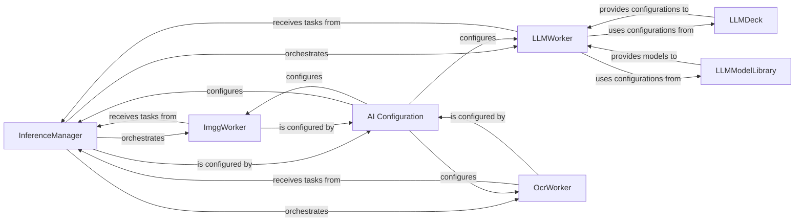

## Details

The AI Integration Layer in pipelex provides a unified interface to various AI service providers, abstracting away their specific APIs, and is utilized by the Pipe Operators for AI-related tasks. This layer is primarily encapsulated within the pipelex.cogt package.

### InferenceManager
The central orchestrator for all AI inference tasks (LLM, Image Generation, OCR). It receives inference requests and dispatches them to the appropriate specialized AI workers.

**Related Classes/Methods**:

- `pipelex.cogt.inference.inference_manager`

### LLMWorker
Defines the abstract interface for interacting with various Large Language Model (LLM) providers. Concrete implementations (e.g., Anthropic, OpenAI) handle provider-specific API calls.

**Related Classes/Methods**:

- `pipelex.cogt.llm.llm_worker_abstract`

### ImggWorker
Defines the abstract interface for interacting with different Image Generation (Imgg) providers. Concrete implementations handle provider-specific API calls.

**Related Classes/Methods**:

- `pipelex.cogt.imgg.imgg_worker_abstract`

### OcrWorker
Defines the abstract interface for interacting with various Optical Character Recognition (OCR) providers. Concrete implementations handle provider-specific API calls.

**Related Classes/Methods**:

- `pipelex.cogt.ocr.ocr_worker_abstract`

### LLMDeck
Manages and validates configurations for various LLMs, ensuring correct setup and parameters for AI interactions.

**Related Classes/Methods**:

- `pipelex.cogt.llm.llm_models.llm_deck`

### LLMModelLibrary
Provides access to loaded LLM model definitions and acts as a central repository for LLM models, enabling workers to retrieve necessary model information.

**Related Classes/Methods**:

- `pipelex.cogt.llm.llm_models.llm_model_library`

### AI Configuration
Encapsulates specific configuration models (`LLMConfig`, `ImggConfig`, `OcrConfig`, `InferenceManagerConfig`) used to set up and run various AI tasks across the subsystem.

**Related Classes/Methods**:

- `pipelex.cogt.config_cogt`

### [FAQ](https://github.com/CodeBoarding/GeneratedOnBoardings/tree/main?tab=readme-ov-file#faq)
