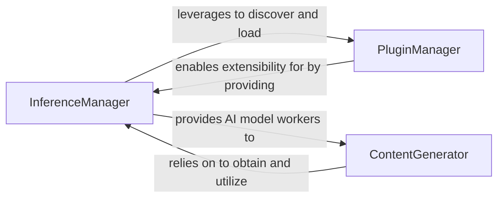

## Details

This subsystem provides a unified facade for interacting with various AI/ML models (LLMs, Image Generators, OCR engines) from different platforms and manages the integration and lifecycle of external AI/ML SDKs and plugins. It is a critical part of the `pipelex` framework, embodying the "Extensible AI Integration Layer" and supporting the "AI/ML Workflow Orchestration Framework/Library" and "Plugin/Extension Architecture" patterns.

### InferenceManager
Acts as a unified facade and orchestrator for various AI/ML model workers, including Large Language Models (LLMs), Image Generators (Imgg), and Optical Character Recognition (OCR) engines. It is responsible for managing the lifecycle (setup, retrieval, and teardown) of these workers and provides a centralized point of access to different AI capabilities. It also supports dynamic registration of external LLM workers, reinforcing its role in extensibility. This component embodies aspects of the "Core Workflow Engine" (specifically the LLM Integration Layer) and the "Facade Pattern."

**Related Classes/Methods**:

- <a href="https://github.com/Pipelex/pipelex/blob/main/pipelex/cogt/inference/inference_manager.py#L23-L186" target="_blank" rel="noopener noreferrer">`InferenceManager`:23-186</a>

### ContentGenerator
Specializes in generating diverse content (text, structured objects, images, OCR extractions, Jinja2 templated text) by leveraging the underlying AI/ML models. It encapsulates the logic for preparing prompts, handling model settings, and processing the outputs from various AI models. This component represents a specialized "Pipe Operator/Implementation" within the "LLM Integration Layer" and extends to other AI modalities like image generation and OCR.

**Related Classes/Methods**:

- <a href="https://github.com/Pipelex/pipelex/blob/main/pipelex/cogt/content_generation/content_generator.py#L39-L281" target="_blank" rel="noopener noreferrer">`ContentGenerator`:39-281</a>

### PluginManager
Manages the lifecycle of plugins, including their discovery, loading, registration, and provision to other parts of the system. It is crucial for enabling the extensibility of the `pipelex` framework, allowing new AI models, data sources, or custom logic to be integrated seamlessly. This component directly implements the "Extensibility & Plugin System" and "Plugin Management" architectural patterns.

**Related Classes/Methods**:

- <a href="https://github.com/Pipelex/pipelex/blob/main/pipelex/plugins/plugin_manager.py#L9-L27" target="_blank" rel="noopener noreferrer">`PluginManager`:9-27</a>

### [FAQ](https://github.com/CodeBoarding/GeneratedOnBoardings/tree/main?tab=readme-ov-file#faq)
