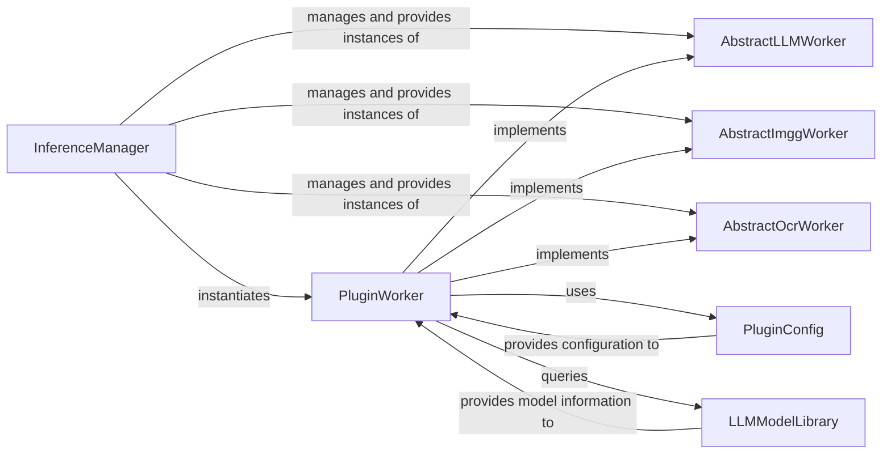

## Details

The Pipelex AI subsystem is designed around a flexible plugin-based architecture for integrating diverse AI capabilities. The `InferenceManager` serves as the central orchestrator, acting as a factory and registry for various AI worker instances. It provides a unified interface for the system to access Large Language Model (`AbstractLLMWorker`), Image Generation (`AbstractImggWorker`), and Optical Character Recognition (`AbstractOcrWorker`) functionalities. Concrete implementations of these abstract workers are provided by `PluginWorker` components, which are dynamically loaded from the `pipelex.plugins` directory. These `PluginWorker` instances adapt generic AI calls to specific third-party AI service APIs, handling API interactions, request/response translation, and service-specific error handling. Each `PluginWorker` relies on `PluginConfig` for managing sensitive configuration details like API keys and endpoints, ensuring secure and centralized credential management. Additionally, `PluginWorker` components interact with the `LLMModelLibrary` to retrieve model-specific information and capabilities, enabling dynamic model selection and configuration. This design promotes extensibility, allowing new AI services to be integrated by simply adding new plugin implementations.

### InferenceManager
Acts as a centralized factory and registry for all AI worker instances (LLM, Image Generation, OCR). It provides a unified interface for the rest of the system to obtain AI capabilities, managing the lifecycle and configuration of these workers.

**Related Classes/Methods**:

- <a href="https://github.com/Pipelex/pipelex/blob/main/pipelex/cogt/inference/inference_manager.py#L23-L186" target="_blank" rel="noopener noreferrer">`pipelex.cogt.inference.inference_manager.InferenceManager`:23-186</a>

### AbstractLLMWorker
Defines the abstract contract for all Large Language Model (LLM) operations, including methods for generating text (`gen_text`) and structured objects (`gen_object`). This ensures a consistent interface across different LLM providers.

**Related Classes/Methods**:

- <a href="https://github.com/Pipelex/pipelex/blob/main/pipelex/cogt/llm/llm_worker_abstract.py" target="_blank" rel="noopener noreferrer">`pipelex.cogt.llm.llm_worker_abstract.AbstractLLMWorker`</a>

### AbstractImggWorker
Defines the abstract contract for all Image Generation (Imgg) operations, including methods for generating single images (`gen_image`) and lists of images (`gen_image_list`).

**Related Classes/Methods**:

- <a href="https://github.com/Pipelex/pipelex/blob/main/pipelex/cogt/imgg/imgg_worker_abstract.py" target="_blank" rel="noopener noreferrer">`pipelex.cogt.imgg.imgg_worker_abstract.AbstractImggWorker`</a>

### AbstractOcrWorker
Defines the abstract contract for all Optical Character Recognition (OCR) operations, specifically for extracting text from pages (`ocr_extract_pages`).

**Related Classes/Methods**:

- <a href="https://github.com/Pipelex/pipelex/blob/main/pipelex/cogt/ocr/ocr_worker_abstract.py" target="_blank" rel="noopener noreferrer">`pipelex.cogt.ocr.ocr_worker_abstract.AbstractOcrWorker`</a>

### PluginWorker
Provides concrete implementations of the `AbstractWorker` interfaces (LLM, Imgg, OCR). These components adapt Pipelex's generic worker calls to the specific API requirements of various third-party AI services (e.g., Anthropic, OpenAI, Google Vertex). They handle API calls, request/response translation, and service-specific error handling.

**Related Classes/Methods**:

- <a href="https://github.com/Pipelex/pipelex/blob/main/pipelex/plugins" target="_blank" rel="noopener noreferrer">`pipelex.plugins.PluginWorker`</a>

### PluginConfig
Manages and provides configuration details, including API keys, endpoints, and region settings, for specific third-party AI services. It acts as a secure and centralized store for sensitive credentials.

**Related Classes/Methods**:

- <a href="https://github.com/Pipelex/pipelex/blob/main/pipelex/plugins" target="_blank" rel="noopener noreferrer">`pipelex.plugins.PluginConfig`</a>

### LLMModelLibrary
Manages a catalog of available LLM models, including their definitions, versions, and capabilities. It provides a mechanism to retrieve model-specific details and properties.

**Related Classes/Methods**:

- <a href="https://github.com/Pipelex/pipelex/blob/main/pipelex/cogt/llm/llm_models/llm_model_library.py#L33-L158" target="_blank" rel="noopener noreferrer">`pipelex.cogt.llm.llm_models.llm_model_library.LLMModelLibrary`:33-158</a>

### [FAQ](https://github.com/CodeBoarding/GeneratedOnBoardings/tree/main?tab=readme-ov-file#faq)
