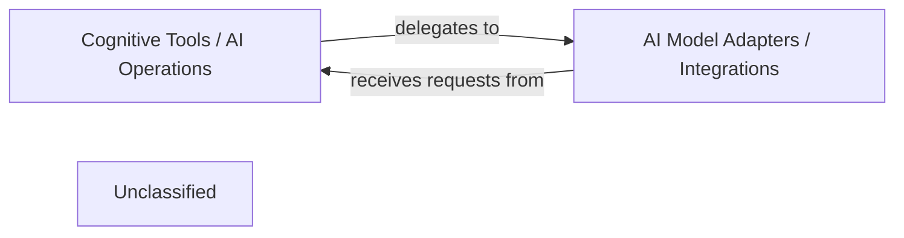

## Details

The `pipelex` project leverages a modular architecture to integrate and manage various AI capabilities. The `Cognitive Tools / AI Operations` component, primarily embodied by the `InferenceManager`, acts as the central orchestrator for all AI-related tasks. It provides a high-level interface for requesting services from Large Language Models (LLMs), Optical Character Recognition (OCR), and Image Generation models. This component is responsible for routing these requests to the appropriate AI workers and managing their lifecycle. The `AI Model Adapters / Integrations` component, managed by the `PluginManager`, houses the concrete implementations for interacting with diverse third-party AI service providers. These adapters abstract away the complexities of each provider's API, enabling the `InferenceManager` to interact with different AI models seamlessly without needing to know their underlying specifics. This clear separation of concerns allows for easy extension and integration of new AI models and providers.

### Cognitive Tools / AI Operations
This component provides a unified, abstract interface for interacting with various AI models (LLMs, OCR, Image Generation) and manages the routing and inference operations. It acts as a high-level orchestrator for AI capabilities within the pipeline, abstracting the underlying AI service providers. It serves as the primary entry point for the rest of the system to request AI services without needing to know the specifics of the underlying models or providers.

**Related Classes/Methods**:

- <a href="https://github.com/Pipelex/pipelex/blob/mainpipelex/cogt/inference/inference_manager.py#L18-L149" target="_blank" rel="noopener noreferrer">`pipelex.cogt.inference.inference_manager.InferenceManager`:18-149</a>

### AI Model Adapters / Integrations
This component contains concrete implementations for integrating with specific third-party AI service providers (e.g., Anthropic, Google, Mistral, AWS Bedrock, OpenAI, FAL). It abstracts away the API specifics, authentication, and data formatting requirements of each external AI service, translating generic AI requests into provider-specific calls.

**Related Classes/Methods**:

- <a href="https://github.com/Pipelex/pipelex/blob/mainpipelex/plugins/plugin_manager.py#L4-L12" target="_blank" rel="noopener noreferrer">`pipelex.plugins.plugin_manager.PluginManager`:4-12</a>

### Unclassified
Component for all unclassified files and utility functions (Utility functions/External Libraries/Dependencies)

**Related Classes/Methods**: _None_

### [FAQ](https://github.com/CodeBoarding/GeneratedOnBoardings/tree/main?tab=readme-ov-file#faq)
