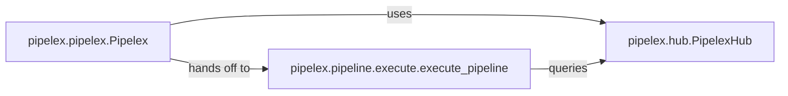

## Details

The Core Workflow Engine subsystem is the central orchestrator of Pipelex applications, managing the entire lifecycle from definition parsing to execution. It embodies the Pipeline Architecture and leverages the Facade Pattern to provide a streamlined user experience.

### pipelex.pipelex.Pipelex
This class serves as the Facade for the Pipelex framework, providing the high-level API for users to define, load, and run pipelines. It acts as the primary entry point, abstracting the complexities of pipeline parsing, component resolution, and execution initiation. It orchestrates the initial steps of a workflow, delegating to other components for specific tasks.

**Related Classes/Methods**:

- <a href="https://github.com/Pipelex/pipelex/blob/main/pipelex/pipelex.py#L61-L301" target="_blank" rel="noopener noreferrer">`pipelex.pipelex.Pipelex`:61-301</a>

### pipelex.hub.PipelexHub
This class functions as a central Registry and Factory for managing and providing access to various pipeline components, configurations, and pre-defined pipeline structures. It is a key enabler of the Plugin/Extension Architecture and Strategy Pattern, allowing the framework to be extensible with new "pipe" types and operational units. It acts as a "hub" for available "pipes" that can be assembled into workflows.

**Related Classes/Methods**:

- <a href="https://github.com/Pipelex/pipelex/blob/main/pipelex/hub.py#L39-L299" target="_blank" rel="noopener noreferrer">`pipelex.hub.PipelexHub`:39-299</a>

### pipelex.pipeline.execute.execute_pipeline
This function is the core Executor responsible for interpreting and running a given pipeline definition. It processes the sequence of operations defined in a pipeline, ensuring each "pipe" or step is executed correctly, and manages the data flow between them. This aligns directly with the Pipeline Architecture and potentially the Interpreter Pattern if it's parsing a DSL.

**Related Classes/Methods**:

- <a href="https://github.com/Pipelex/pipelex/blob/main/pipelex/pipeline/execute.py#L25-L111" target="_blank" rel="noopener noreferrer">`pipelex.pipeline.execute.execute_pipeline`:25-111</a>

### [FAQ](https://github.com/CodeBoarding/GeneratedOnBoardings/tree/main?tab=readme-ov-file#faq)
