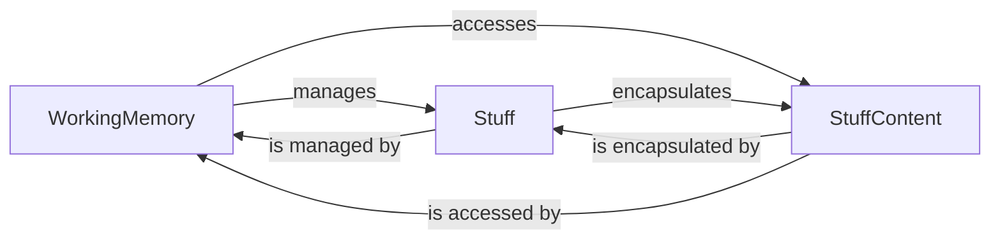

## Details

This subsystem is a critical part of the `pipelex` framework, providing the foundational mechanisms for managing data and execution context throughout an AI/ML workflow. It acts as the central nervous system for data flow, ensuring that information is consistently available and correctly interpreted across different pipeline stages.

### WorkingMemory
The central, dynamic, in-memory store for all data (`Stuff` objects) and the execution context of a `pipelex` workflow. It provides a comprehensive API for managing this data, including adding, retrieving, updating, and removing `Stuff` objects, and handling their naming and aliasing. It ensures data consistency and facilitates data retrieval in various formats. This component is fundamental for state management and data passing between pipeline steps in an AI/ML workflow.

**Related Classes/Methods**:

- <a href="https://github.com/Pipelex/pipelex/blob/main/pipelex/core/working_memory.py#L39-L376" target="_blank" rel="noopener noreferrer">`pipelex.core.working_memory.WorkingMemory`:39-376</a>

### Stuff
Represents the fundamental, atomic unit of data within the `pipelex` framework. It encapsulates a specific piece of content (`StuffContent`) along with essential metadata (e.g., `stuff_code`, `stuff_name`, `concept_code`). It provides methods for identifying the content type and safely accessing or converting the content into various formats. This component is crucial for enabling seamless data passing and state management in a DSL-driven workflow.

**Related Classes/Methods**:

- <a href="https://github.com/Pipelex/pipelex/blob/main/pipelex/core/stuff.py#L26-L198" target="_blank" rel="noopener noreferrer">`pipelex.core.stuff.Stuff`:26-198</a>

### StuffContent
Defines the actual data payloads that `Stuff` objects encapsulate. Each concrete `StuffContent` subclass (e.g., `TextContent`, `ImageContent`, `ListContent`, `PDFContent`) represents a specific type of data that can be processed within the `pipelex` framework. This supports the extensibility and plugin architecture by allowing new data types to be easily integrated into the workflow.

**Related Classes/Methods**:

- <a href="https://github.com/Pipelex/pipelex/blob/main/pipelex/core/stuff.py#L1-L1000" target="_blank" rel="noopener noreferrer">`pipelex.core.stuff.StuffContent`:1-1000</a>

### [FAQ](https://github.com/CodeBoarding/GeneratedOnBoardings/tree/main?tab=readme-ov-file#faq)
