```mermaid
graph LR
    pipelex_pipeline_pipeline_Pipeline["pipelex.pipeline.pipeline.Pipeline"]
    pipelex_pipeline_track_pipeline_tracker_PipelineTracker["pipelex.pipeline.track.pipeline_tracker.PipelineTracker"]
    pipelex_reporting_reporting_manager_ReportingManager["pipelex.reporting.reporting_manager.ReportingManager"]
    pipelex_cli__cli_PipelexCLI["pipelex.cli._cli.PipelexCLI"]
    Unclassified["Unclassified"]
    pipelex_pipeline_pipeline_Pipeline -- "emits execution data to" --> pipelex_pipeline_track_pipeline_tracker_PipelineTracker
    pipelex_pipeline_pipeline_Pipeline -- "triggers execution events in" --> pipelex_pipeline_track_pipeline_tracker_PipelineTracker
    pipelex_pipeline_track_pipeline_tracker_PipelineTracker -- "feeds raw data to" --> pipelex_reporting_reporting_manager_ReportingManager
    pipelex_reporting_reporting_manager_ReportingManager -- "processes raw data from" --> pipelex_pipeline_track_pipeline_tracker_PipelineTracker
    pipelex_cli__cli_PipelexCLI -- "requests reports from" --> pipelex_reporting_reporting_manager_ReportingManager
    pipelex_reporting_reporting_manager_ReportingManager -- "provides reports to" --> pipelex_cli__cli_PipelexCLI
```

## Details

The `pipelex` system is structured around a core `Pipeline` component responsible for defining and orchestrating AI workflows. As pipelines execute, the `PipelineTracker` diligently monitors and collects granular execution data and events, forming the foundation for performance and activity insights. This raw tracking data is then consumed by the `ReportingManager`, which processes and transforms it into actionable reports and visualizations. Users interact with the system primarily through the `PipelexCLI`, which facilitates the request and display of these generated reports, enabling effective monitoring and analysis of pipeline operations.

### pipelex.pipeline.pipeline.Pipeline
Represents the definition of an AI pipeline, outlining its structure and configuration. It serves as a blueprint for execution, defining the sequence of operations and data flow.

**Related Classes/Methods**:

- <a href="https://github.com/Pipelex/pipelex/blob/mainpipelex/pipeline/pipeline.py#L4-L5" target="_blank" rel="noopener noreferrer">`pipelex.pipeline.pipeline.Pipeline`:4-5</a>

### pipelex.pipeline.track.pipeline_tracker.PipelineTracker
The data acquisition layer of the monitoring subsystem. It actively observes, collects, and records raw execution data, events, and metrics emitted by the pipeline during workflow execution. This component is crucial for capturing the granular details of each step.

**Related Classes/Methods**:

- <a href="https://github.com/Pipelex/pipelex/blob/mainpipelex/pipeline/track/pipeline_tracker.py#L30-L364" target="_blank" rel="noopener noreferrer">`pipelex.pipeline.track.pipeline_tracker.PipelineTracker`:30-364</a>

### pipelex.reporting.reporting_manager.ReportingManager
The processing and presentation layer of the monitoring subsystem. It aggregates, analyzes, and transforms the raw tracking data received from `pipelex.pipeline.track.pipeline_tracker.PipelineTracker` into meaningful reports, summaries, and visualizations (e.g., activity logs, usage metrics, performance dashboards, and visual flowcharts).

**Related Classes/Methods**:

- <a href="https://github.com/Pipelex/pipelex/blob/mainpipelex/reporting/reporting_manager.py#L30-L122" target="_blank" rel="noopener noreferrer">`pipelex.reporting.reporting_manager.ReportingManager`:30-122</a>

### pipelex.cli._cli.PipelexCLI
The command-line interface component that serves as the primary user interaction point. It allows users to interact with the system, including requesting and displaying reports generated by the `pipelex.reporting.reporting_manager.ReportingManager`.

**Related Classes/Methods**:

- <a href="https://github.com/Pipelex/pipelex/blob/mainpipelex/cli/_cli.py#L12-L20" target="_blank" rel="noopener noreferrer">`pipelex.cli._cli.PipelexCLI`:12-20</a>

### Unclassified
Component for all unclassified files and utility functions (Utility functions/External Libraries/Dependencies)

**Related Classes/Methods**: _None_

### [FAQ](https://github.com/CodeBoarding/GeneratedOnBoardings/tree/main?tab=readme-ov-file#faq)
