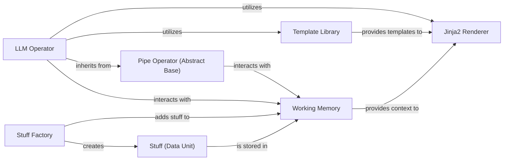

## Details

This subsystem is crucial for the execution layer of the `pipelex` project, embodying the "Execution Layer" and "Data/Knowledge Management" architectural patterns. The central components are chosen for their fundamental role in defining, executing, and managing data flow within the pipeline.

### Pipe Operator (Abstract Base)
Defines the abstract interface and common execution flow (`run_pipe`, `_dry_run_operator_pipe`, `_run_operator_pipe`) for all concrete pipe operators. It acts as the base for specialized data processing units.

**Related Classes/Methods**:

- <a href="https://github.com/Pipelex/pipelex/blob/main/pipelex/pipe_operators/pipe_operator.py" target="_blank" rel="noopener noreferrer">`pipelex.pipe_operators.pipe_operator`</a>
- <a href="https://github.com/Pipelex/pipelex/blob/main/pipelex/pipe_operators/pipe_operator.py" target="_blank" rel="noopener noreferrer">`pipelex.pipe_operators.pipe_operator:run_pipe`</a>
- <a href="https://github.com/Pipelex/pipelex/blob/main/pipelex/pipe_operators/pipe_operator.py" target="_blank" rel="noopener noreferrer">`pipelex.pipe_operators.pipe_operator:_dry_run_operator_pipe`</a>
- <a href="https://github.com/Pipelex/pipelex/blob/main/pipelex/pipe_operators/pipe_operator.py" target="_blank" rel="noopener noreferrer">`pipelex.pipe_operators.pipe_operator:_run_operator_pipe`</a>

### LLM Operator
A concrete implementation of `pipe_operator` specialized for interacting with Large Language Models (LLMs). It handles input validation, content generation (`_llm_gen_object_stuff_content`), and structuring LLM outputs.

**Related Classes/Methods**:

- <a href="https://github.com/Pipelex/pipelex/blob/main/pipelex/pipe_operators/llm/pipe_llm.py" target="_blank" rel="noopener noreferrer">`pipelex.pipe_operators.llm.pipe_llm`</a>
- <a href="https://github.com/Pipelex/pipelex/blob/main/pipelex/pipe_operators/llm/pipe_llm.py" target="_blank" rel="noopener noreferrer">`pipelex.pipe_operators.llm.pipe_llm:_llm_gen_object_stuff_content`</a>

### Working Memory [[Expand]](./Working_Memory.md)
Serves as the central, transient data store for `stuff` objects during pipeline execution. Provides methods for adding, retrieving, and managing data.

**Related Classes/Methods**:

- <a href="https://github.com/Pipelex/pipelex/blob/main/pipelex/core/memory/working_memory.py" target="_blank" rel="noopener noreferrer">`pipelex.core.memory.working_memory`</a>

### Stuff (Data Unit)
Represents the atomic unit of data within the system. It encapsulates content and metadata, providing methods to access content in various formats.

**Related Classes/Methods**:

- <a href="https://github.com/Pipelex/pipelex/blob/main/pipelex/core/stuffs/stuff.py" target="_blank" rel="noopener noreferrer">`pipelex.core.stuffs.stuff`</a>

### Stuff Factory
Facilitates the creation and combination of `stuff` objects from diverse inputs (strings, concepts, blueprints). It acts as the primary mechanism for populating `working_memory` with initial data or new data generated by operators.

**Related Classes/Methods**:

- <a href="https://github.com/Pipelex/pipelex/blob/main/pipelex/core/stuffs/stuff_factory.py" target="_blank" rel="noopener noreferrer">`pipelex.core.stuffs.stuff_factory`</a>

### Jinja2 Renderer
Handles the actual rendering of Jinja2 templates by integrating context (often derived from `working_memory`) into the templating environment.

**Related Classes/Methods**:

- <a href="https://github.com/Pipelex/pipelex/blob/main/pipelex/tools/templating/jinja2_rendering.py" target="_blank" rel="noopener noreferrer">`pipelex.tools.templating.jinja2_rendering`</a>

### Template Library
Manages a collection of templates, loading them from configuration files and providing access to them for rendering.

**Related Classes/Methods**:

- <a href="https://github.com/Pipelex/pipelex/blob/main/pipelex/tools/templating/template_library.py" target="_blank" rel="noopener noreferrer">`pipelex.tools.templating.template_library`</a>

### [FAQ](https://github.com/CodeBoarding/GeneratedOnBoardings/tree/main?tab=readme-ov-file#faq)
