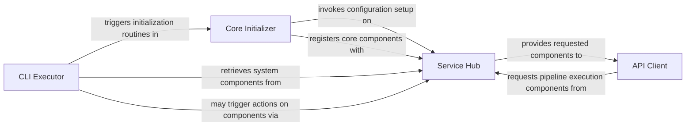

## Details

The `Pipelex Core & User Interface` subsystem serves as the primary interaction layer and foundational control mechanism for the Pipelex application. It encompasses the initial setup, central orchestration, and user-facing interfaces (CLI and programmatic API).

### Core Initializer
Manages the initial setup, configuration loading, and bootstrapping of the Pipelex environment. It serves as the primary application entry point, preparing the system for operation and integrating necessary dependencies. This component is crucial for any Data Processing Library or AI Workflow Orchestration Tool as it establishes the runtime environment.

**Related Classes/Methods**:

- <a href="https://github.com/Pipelex/pipelex/blob/main/pipelex/pipelex.py#L61-L305" target="_blank" rel="noopener noreferrer">`pipelex.pipelex`:61-305</a>

### Service Hub
Acts as the central control unit and dependency injector, providing a unified access point to all core components, configurations, and specialized managers/providers throughout the system. It orchestrates the overall system by enabling various parts to discover and interact without tight coupling, supporting the modular and plugin architecture. This aligns with the "Orchestration" and "Plugin/Extension Architecture" patterns.

**Related Classes/Methods**:

- <a href="https://github.com/Pipelex/pipelex/blob/main/pipelex/hub.py" target="_blank" rel="noopener noreferrer">`pipelex.hub`</a>

### CLI Executor
Processes command-line inputs, translates them into Pipelex operations, and provides user feedback. It handles administrative and operational tasks such as migration, initialization, validation, and information display, serving as the primary command-line interface for user interaction. This is a standard component for any robust Data Processing Library, providing direct user control.

**Related Classes/Methods**:

- <a href="https://github.com/Pipelex/pipelex/blob/main/pipelex/cli/commands/__init__.py" target="_blank" rel="noopener noreferrer">`pipelex.cli.commands.__init__`</a>

### API Client
Enables external systems or applications to programmatically interact with Pipelex. It facilitates the initiation of pipeline executions and retrieval of results, providing a programmatic interface for integration into larger systems. Essential for an AI Workflow Orchestration Tool, allowing integration into broader MLOps ecosystems.

**Related Classes/Methods**:

- <a href="https://github.com/Pipelex/pipelex/blob/main/pipelex/client/client.py" target="_blank" rel="noopener noreferrer">`pipelex.client.client`</a>

### [FAQ](https://github.com/CodeBoarding/GeneratedOnBoardings/tree/main?tab=readme-ov-file#faq)
