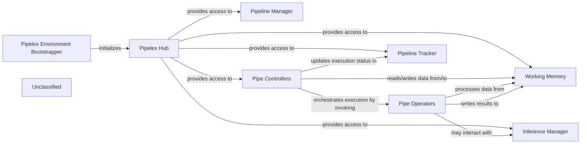

## Details

The Pipelex system is initiated by the `Pipelex Environment Bootstrapper`, which sets up the foundational environment and the `Pipelex Hub`. The `Pipelex Hub` acts as a central service locator, providing core components like the `Pipeline Manager`, `Pipe Controllers`, `Working Memory`, `Pipeline Tracker`, and `Inference Manager` with necessary dependencies. The `Pipeline Manager` oversees the lifecycle of pipeline instances. `Pipe Controllers` are responsible for orchestrating the execution flow of pipelines, interpreting declarative definitions, and invoking `Pipe Operators`. `Pipe Operators` are the atomic units that perform specific AI/ML tasks or data transformations. During execution, `Pipe Controllers` and `Pipe Operators` interact with `Working Memory` for transient data storage and `Pipeline Tracker` for monitoring and recording the execution path. The `Inference Manager`, a specialized service for AI inference, is accessed through the `Pipelex Hub` and utilized by `Pipe Operators` for AI-specific tasks.

### Pipelex Environment Bootstrapper
Initializes the entire Pipelex system, including the Pipelex Hub, setting up the foundational environment for pipeline execution.

**Related Classes/Methods**:

- <a href="https://github.com/Pipelex/pipelex/blob/main/pipelex/__init__.py" target="_blank" rel="noopener noreferrer">`pipelex.__init__`</a>

### Pipelex Hub
Acts as a central service locator and dependency injection container. It provides other components within the execution core with access to various managers, providers, and workers (e.g., PipelineManager, InferenceManager).

**Related Classes/Methods**:

- <a href="https://github.com/Pipelex/pipelex/blob/main/pipelex/hub.py" target="_blank" rel="noopener noreferrer">`pipelex.hub`</a>

### Pipeline Manager
Manages the lifecycle of pipeline instances. It is responsible for creating new pipelines, retrieving existing ones by their run ID, and handling their state or persistence.

**Related Classes/Methods**:

- <a href="https://github.com/Pipelex/pipelex/blob/main/pipelex/pipeline/pipeline_manager.py" target="_blank" rel="noopener noreferrer">`pipelex.pipeline.pipeline_manager`</a>

### Pipe Controllers
The primary orchestrator of pipeline execution. It interprets declarative pipeline definitions (e.g., sequences, parallel branches, conditional logic, batch processing) and drives the execution flow by invoking appropriate Pipe Operators.

**Related Classes/Methods**:

- <a href="https://github.com/Pipelex/pipelex/blob/main/pipelex/pipe_controllers/" target="_blank" rel="noopener noreferrer">`pipelex.pipe_controllers`</a>

### Pipe Operators
Implements the core logic for individual "pipe" types. These are the atomic units of work within a pipeline, performing specific AI/ML tasks (e.g., LLM calls, OCR, image generation) or data transformations.

**Related Classes/Methods**:

- <a href="https://github.com/Pipelex/pipelex/blob/main/pipelex/pipe_operators/" target="_blank" rel="noopener noreferrer">`pipelex.pipe_operators`</a>

### Working Memory
Serves as the transient data store for 'Stuff' objects that flow between pipes during a pipeline's execution. It manages the state and data context for the currently running pipeline, ensuring data consistency and availability for subsequent steps.

**Related Classes/Methods**:

- <a href="https://github.com/Pipelex/pipelex/blob/main/pipelex/core/memory/working_memory.py" target="_blank" rel="noopener noreferrer">`pipelex.core.memory.working_memory`</a>

### Pipeline Tracker
Monitors and records the execution path of a pipeline, including the sequence of executed pipes, conditional branches taken, and parallel tasks. It is crucial for debugging, auditing, and generating visual representations of the execution flow.

**Related Classes/Methods**:

- <a href="https://github.com/Pipelex/pipelex/blob/main/pipelex/pipeline/track/pipeline_tracker.py" target="_blank" rel="noopener noreferrer">`pipelex.pipeline.track.pipeline_tracker`</a>

### Inference Manager
A specialized service for managing and executing AI inference tasks, often interacting with external LLM providers. It is accessed via the Pipelex Hub and utilized by Pipe Operators for AI-specific tasks.

**Related Classes/Methods**:

- <a href="https://github.com/Pipelex/pipelex/blob/main/pipelex/cogt/inference/inference_manager.py" target="_blank" rel="noopener noreferrer">`pipelex.cogt.inference.inference_manager`</a>

### Unclassified
Component for all unclassified files and utility functions (Utility functions/External Libraries/Dependencies)

**Related Classes/Methods**: _None_

### [FAQ](https://github.com/CodeBoarding/GeneratedOnBoardings/tree/main?tab=readme-ov-file#faq)
