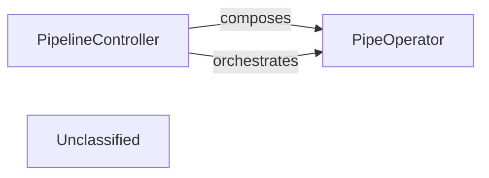

## Details

This system provides a framework for orchestrating AI tasks. The PipelineController acts as the central execution engine, responsible for interpreting workflows and managing the execution flow of various tasks. It coordinates the invocation of individual PipeOperator instances, which represent atomic, self-contained steps within the pipeline, such as LLM calls or data transformations. The overall purpose is to ensure robust and repeatable execution of AI workflows.

### PipelineController
This component serves as the core execution engine for the entire pipeline. It is responsible for interpreting the defined workflow, managing the execution flow (sequential, parallel, conditional, batch), and coordinating the invocation of individual `PipeOperator` instances. It embodies the "Workflow Orchestrator/Engine" pattern, ensuring robust and repeatable execution of AI tasks.

**Related Classes/Methods**:

- `pipelex.pipelines.pipeline_controller`:10-25

### PipeOperator
Represents an atomic, self-contained step or task within a pipeline. Each `PipeOperator` encapsulates a specific operation, such as calling an LLM, performing data transformation, or integrating with an external service. It aligns with the "Pipe Executors/Runners" pattern, providing the modular units of work that the `PipelineController` orchestrates.

**Related Classes/Methods**:

- <a href="https://github.com/Pipelex/pipelex/blob/mainpipelex/pipe_operators/pipe_operator.py#L16-L90" target="_blank" rel="noopener noreferrer">`pipelex.pipelines.pipe_operator`:16-90</a>

### Unclassified
Component for all unclassified files and utility functions (Utility functions/External Libraries/Dependencies)

**Related Classes/Methods**: _None_

### [FAQ](https://github.com/CodeBoarding/GeneratedOnBoardings/tree/main?tab=readme-ov-file#faq)
