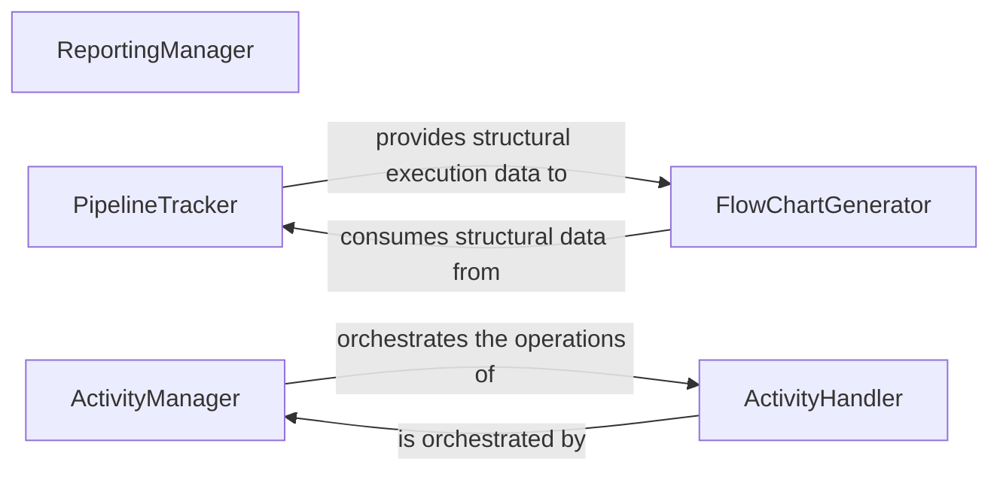

## Details

The `Reporting & Monitoring` subsystem is critical for providing visibility into pipeline execution, resource consumption, and operational activities within the `pipelex` AI Workflow Orchestration Library. It encompasses modules responsible for tracking pipeline flow, logging detailed activities, and generating usage reports.

### ReportingManager
Orchestrates the collection and aggregation of usage data, specifically focusing on token consumption from LLM inference. It is responsible for generating financial reports to manage AI workflow costs. It manages an internal `UsageRegistry`.

**Related Classes/Methods**:

- <a href="https://github.com/Pipelex/pipelex/blob/main/pipelex/reporting/reporting_manager.py#L30-L122" target="_blank" rel="noopener noreferrer">`pipelex.reporting.reporting_manager.ReportingManager`:30-122</a>

### PipelineTracker
Monitors and records the execution path of a pipeline, capturing each step (e.g., pipes, batches, conditions, choices) to construct a logical flow representation. Its primary output is data used for visual flowcharts.

**Related Classes/Methods**:

- <a href="https://github.com/Pipelex/pipelex/blob/main/pipelex/pipeline/track/pipeline_tracker.py#L30-L364" target="_blank" rel="noopener noreferrer">`pipelex.pipeline.track.pipeline_tracker.PipelineTracker`:30-364</a>

### FlowChartGenerator
Specializes in generating Mermaid syntax for visual flowcharts based on the structural data provided by the `PipelineTracker`.

**Related Classes/Methods**:

- <a href="https://github.com/Pipelex/pipelex/blob/main/pipelex/pipeline/track/flow_chart.py" target="_blank" rel="noopener noreferrer">`pipelex.pipeline.track.flow_chart.FlowChartGenerator`</a>

### ActivityManager
Manages the overall lifecycle of activity tracking within pipelines, including the proper initialization and cleanup of activity-related resources.

**Related Classes/Methods**:

- <a href="https://github.com/Pipelex/pipelex/blob/main/pipelex/pipeline/activity/activity_manager.py#L16-L46" target="_blank" rel="noopener noreferrer">`pipelex.pipeline.activity.activity_manager.ActivityManager`:16-46</a>

### ActivityHandler
Processes and categorizes various types of content generated during pipeline execution (e.g., text, images, structured data, Mermaid diagrams), assigning unique identifiers to each activity.

**Related Classes/Methods**:

- <a href="https://github.com/Pipelex/pipelex/blob/main/pipelex/pipeline/activity/activity_handler.py#L23-L132" target="_blank" rel="noopener noreferrer">`pipelex.pipeline.activity.activity_handler.ActivityHandler`:23-132</a>

### [FAQ](https://github.com/CodeBoarding/GeneratedOnBoardings/tree/main?tab=readme-ov-file#faq)
