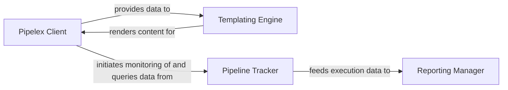

## Details

The Pipelex system facilitates AI/ML workflow orchestration, with the `Pipelex Client` serving as the primary user interface for defining and initiating pipelines. This client interacts with a `Templating Engine` to dynamically generate content, such as LLM prompts or configurations, ensuring flexible workflow execution. As pipelines run, the `Pipeline Tracker` diligently monitors and records all execution events and statuses, acting as the central data collection point for observability. This raw execution data is then fed to the `Reporting Manager`, which aggregates and processes it to generate insightful reports on pipeline performance and errors, providing critical analytics for users.

### Pipelex Client
Serves as the primary programmatic interface for users to define, configure, and initiate AI/ML workflows. It acts as a facade to the underlying orchestration engine, abstracting its complexity. This aligns with the "User Interfaces (with Programmatic API)" pattern, providing the main entry point for developers.

**Related Classes/Methods**:

- <a href="https://github.com/Pipelex/pipelex/blob/main/pipelex/client/client.py#L16-L121" target="_blank" rel="noopener noreferrer">`PipelexClient`:16-121</a>

### Templating Engine
Manages the rendering of dynamic content using Jinja2 templates. This is crucial for generating prompts for LLMs, dynamic configurations, or other variable data required during workflow execution, supporting the "Extensible AI Integration Layer" and "Core Workflow Engine" patterns by enabling dynamic content generation.

**Related Classes/Methods**:

- <a href="https://github.com/Pipelex/pipelex/blob/main/pipelex/tools/templating/jinja2_rendering.py#L34-L102" target="_blank" rel="noopener noreferrer">`render_jinja2`:34-102</a>

### Pipeline Tracker
Monitors and records the execution flow, status, and key events of pipelines. It provides the foundational data for understanding pipeline performance and debugging, directly supporting "Monitoring, Logging, & Reporting (with Activity Tracking)". It's the core data collection point for observability.

**Related Classes/Methods**:

- <a href="https://github.com/Pipelex/pipelex/blob/main/pipelex/pipeline/track/pipeline_tracker.py#L30-L358" target="_blank" rel="noopener noreferrer">`PipelineTracker`:30-358</a>

### Reporting Manager
Aggregates and processes data collected by the `Pipeline Tracker` to generate comprehensive reports on pipeline performance, errors, and other metrics, providing actionable insights. This aligns with "Monitoring, Logging, & Reporting (with Reporting & Analytics)", transforming raw tracking data into meaningful information.

**Related Classes/Methods**:

- <a href="https://github.com/Pipelex/pipelex/blob/main/pipelex/reporting/reporting_manager.py#L30-L122" target="_blank" rel="noopener noreferrer">`ReportingManager`:30-122</a>

### [FAQ](https://github.com/CodeBoarding/GeneratedOnBoardings/tree/main?tab=readme-ov-file#faq)
