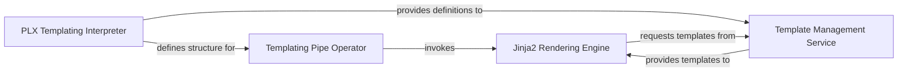

## Details

The `Templating Engine` subsystem is primarily bounded by the `pipelex.tools.templating` package, which provides the core templating utilities, and `pipelex.pipe_operators.jinja2.pipe_jinja2`, which integrates Jinja2 into the pipeline execution. Additionally, components within `pipelex.core.interpreter` are crucial for how templating is defined and serialized within the Pipelex DSL. The main flow involves defining templates and templating operations via the PLX DSL, managing these templates, and then executing them within the pipeline to generate dynamic content.

### Templating Pipe Operator
Acts as the primary interface for integrating Jinja2 templating into the `pipelex` pipeline execution flow. It receives templating instructions from the pipeline orchestrator and orchestrates the rendering process, enabling dynamic content generation within pipes. This component is the direct bridge between the pipeline and the templating functionality.

**Related Classes/Methods**:

- <a href="https://github.com/Pipelex/pipelex/blob/main/pipelex/pipe_operators/jinja2/pipe_jinja2.py" target="_blank" rel="noopener noreferrer">`pipelex.pipe_operators.jinja2.pipe_jinja2`</a>

### Template Management Service
Manages the lifecycle of templates, including loading, storing, validating, and providing access to them. It ensures templates are correctly defined and available for the rendering process, often sourced from PLX (TOML) definitions. This component acts as the central repository and gatekeeper for all templates.

**Related Classes/Methods**:

- <a href="https://github.com/Pipelex/pipelex/blob/main/pipelex/tools/templating/template_library.py" target="_blank" rel="noopener noreferrer">`pipelex.tools.templating.template_library`</a>
- <a href="https://github.com/Pipelex/pipelex/blob/main/pipelex/tools/templating/template_preprocessor.py" target="_blank" rel="noopener noreferrer">`pipelex.tools.templating.template_preprocessor`</a>
- <a href="https://github.com/Pipelex/pipelex/blob/main/pipelex/hub.py#L329-L330" target="_blank" rel="noopener noreferrer">`pipelex.hub.get_template_provider`:329-330</a>

### Jinja2 Rendering Engine
Encapsulates the core Jinja2 functionality, responsible for creating and managing Jinja2 environments, executing the rendering process, and applying custom filters. It injects context (e.g., pipeline variables, previous pipe outputs) into templates to produce the final dynamic content.

**Related Classes/Methods**:

- <a href="https://github.com/Pipelex/pipelex/blob/main/pipelex/tools/templating/jinja2_rendering.py" target="_blank" rel="noopener noreferrer">`pipelex.tools.templating.jinja2_rendering`</a>
- <a href="https://github.com/Pipelex/pipelex/blob/main/pipelex/tools/templating/jinja2_environment.py" target="_blank" rel="noopener noreferrer">`pipelex.tools.templating.jinja2_environment`</a>
- <a href="https://github.com/Pipelex/pipelex/blob/main/pipelex/tools/templating/jinja2_filters.py" target="_blank" rel="noopener noreferrer">`pipelex.tools.templating.jinja2_filters`</a>
- <a href="https://github.com/Pipelex/pipelex/blob/main/pipelex/core/stuffs/stuff_artefact.py" target="_blank" rel="noopener noreferrer">`pipelex.core.stuffs.stuff_artefact:render_tagged_for_jinja2`</a>

### PLX Templating Interpreter
Handles the conversion and serialization of Jinja2 pipe definitions into the Pipelex Language (PLX) string representation. This component is crucial for the DSL's ability to define, store, and interpret templating operations within pipelines, ensuring consistency with the overall `pipelex` DSL.

**Related Classes/Methods**:

- <a href="https://github.com/Pipelex/pipelex/blob/main/pipelex/core/interpreter.py#L398-L418" target="_blank" rel="noopener noreferrer">`pipelex.core.interpreter.jinja2_pipe_to_plx_string`:398-418</a>
- <a href="https://github.com/Pipelex/pipelex/blob/main/pipelex/core/interpreter.py#L781-L803" target="_blank" rel="noopener noreferrer">`pipelex.core.interpreter.serialize_jinja2_pipe`:781-803</a>

### [FAQ](https://github.com/CodeBoarding/GeneratedOnBoardings/tree/main?tab=readme-ov-file#faq)
