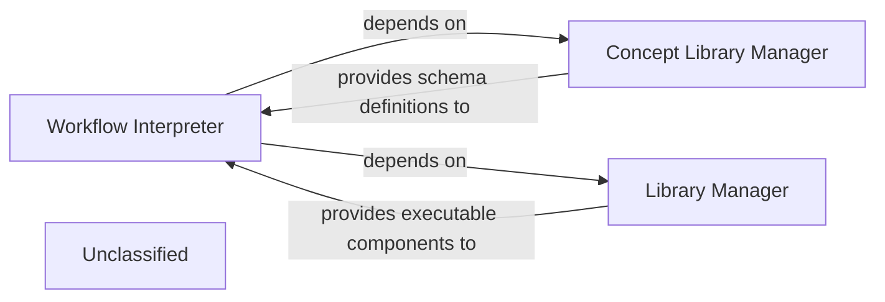

## Details

The core of the system revolves around the `Workflow Interpreter`, which is responsible for processing PLX workflow definitions. It relies on the `Concept Library Manager` to access and validate data schemas ("concepts") used within these workflows, ensuring data consistency. Additionally, the `Workflow Interpreter` interacts with the `Library Manager` to discover and load "pipe" and "domain" libraries, which provide the concrete operational components for executing the defined workflows. This architecture emphasizes a clear separation of concerns, with dedicated components for parsing, data schema management, and library management, facilitating extensibility and maintainability.

### Workflow Interpreter
This component is the core of the subsystem, responsible for parsing the declarative PLX workflow definition, validating its syntax, and translating it into an internal, executable representation. It acts as the primary implementation of the 'PLX Parser/Interpreter' pattern, understanding the flow, conditions, and steps defined in the DSL.

**Related Classes/Methods**:

- <a href="https://github.com/Pipelex/pipelex/blob/mainpipelex/core/interpreter.py#L43-L1043" target="_blank" rel="noopener noreferrer">`pipelex.core.interpreter.PipelexInterpreter`:43-1043</a>

### Concept Library Manager
Manages and provides access to "concepts," which are essentially data schemas defining the structure and types of data used within workflows. It ensures consistency and validity of data flowing through the pipes, aligning with the 'Knowledge/Data Management' aspect for data schemas.

**Related Classes/Methods**:

- <a href="https://github.com/Pipelex/pipelex/blob/mainpipelex/core/concepts/concept_library.py#L19-L125" target="_blank" rel="noopener noreferrer">`pipelex.core.concepts.concept_library.ConceptLibrary`:19-125</a>

### Library Manager
Discovers, loads, and manages "pipe" and "domain" libraries. These libraries contain the concrete AI/ML operations and domain-specific functionalities that are referenced and utilized within the workflows. This component is vital for the project's 'Extensibility/Plugin-based Architecture'.

**Related Classes/Methods**:

- <a href="https://github.com/Pipelex/pipelex/blob/mainpipelex/libraries/library_manager.py#L53-L268" target="_blank" rel="noopener noreferrer">`pipelex.libraries.library_manager.LibraryManager`:53-268</a>

### Unclassified
Component for all unclassified files and utility functions (Utility functions/External Libraries/Dependencies)

**Related Classes/Methods**: _None_

### [FAQ](https://github.com/CodeBoarding/GeneratedOnBoardings/tree/main?tab=readme-ov-file#faq)
