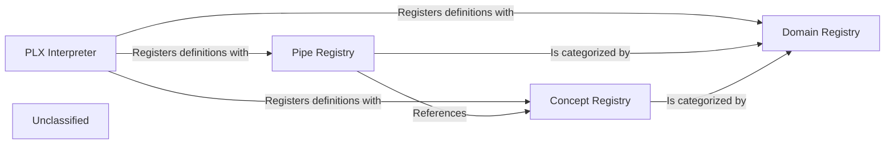

## Details

The `Workflow Definition & Registry` subsystem is responsible for the interpretation of the declarative PLX language and the management of all defined pipes, concepts (data schemas), and domains. It acts as the foundational layer for transforming high-level workflow descriptions into an executable internal representation and maintaining a consistent catalog of available components.

### PLX Interpreter
This component is the primary entry point for processing raw PLX content. It performs lexical analysis, parsing, and semantic validation of pipeline, pipe, concept, and domain definitions. Its core responsibility is to transform these declarative definitions into an executable internal blueprint, registering them with the respective registries.

**Related Classes/Methods**:

- <a href="https://github.com/Pipelex/pipelex/blob/main/pipelex/core/interpreter.py#L30-L1016" target="_blank" rel="noopener noreferrer">`pipelex.core.interpreter.PipelexInterpreter`:30-1016</a>

### Pipe Registry
The Pipe Registry serves as the central repository for all user-defined and native pipe definitions. It manages their lifecycle, including registration, retrieval, and validation. This registry stores critical metadata such as input/output schemas, configuration parameters, and references to their execution logic, ensuring pipes are discoverable and consistently applied within pipelines.

**Related Classes/Methods**:

- <a href="https://github.com/Pipelex/pipelex/blob/main/pipelex/core/pipes/" target="_blank" rel="noopener noreferrer">`pipelex.core.pipes`</a>

### Concept Registry
This component is responsible for managing the lifecycle and availability of all user-defined and native concepts, which represent structured data schemas. It ensures data consistency and type safety across different pipes and pipelines by providing a centralized definition of data types and structures.

**Related Classes/Methods**:

- <a href="https://github.com/Pipelex/pipelex/blob/main/pipelex/core/concepts/" target="_blank" rel="noopener noreferrer">`pipelex.core.concepts`</a>

### Domain Registry
The Domain Registry manages the lifecycle and availability of all user-defined and native domains. Domains likely provide contextual categorization, scoping, or environmental definitions for pipes and concepts, facilitating organization and potentially access control within the PLX ecosystem.

**Related Classes/Methods**:

- <a href="https://github.com/Pipelex/pipelex/blob/main/pipelex/core/domains/" target="_blank" rel="noopener noreferrer">`pipelex.core.domains`</a>

### Unclassified
Component for all unclassified files and utility functions (Utility functions/External Libraries/Dependencies)

**Related Classes/Methods**: _None_

### [FAQ](https://github.com/CodeBoarding/GeneratedOnBoardings/tree/main?tab=readme-ov-file#faq)
