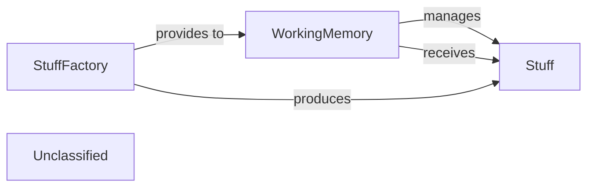

## Details

The `pipelex` core subsystem is designed around the central concept of `Stuff` objects, which are the fundamental data units. The `StuffFactory` is responsible for the initial creation of these `Stuff` objects from diverse input sources, encapsulating them into a standardized format. Once created, these `Stuff` objects are provided to the `WorkingMemory`. The `WorkingMemory` then assumes the critical role of managing the in-memory state of these `Stuff` objects, handling their storage, retrieval, and overall lifecycle within the pipeline, thereby ensuring data consistency and accessibility for subsequent processing stages. This architecture facilitates a clear separation of concerns, with `StuffFactory` handling data ingestion and `WorkingMemory` managing the in-memory data state.

### WorkingMemory
Manages the in-memory state of data ("stuffs") that flows through the pipeline. It acts as the central data bus, providing mechanisms for storing, retrieving, and managing the lifecycle of `Stuff` objects. It ensures data consistency and accessibility across different pipes.

**Related Classes/Methods**:

- <a href="https://github.com/Pipelex/pipelex/blob/main/pipelex/core/memory/working_memory.py#L37-L344" target="_blank" rel="noopener noreferrer">`pipelex.core.memory.working_memory.WorkingMemory`:37-344</a>

### StuffFactory
A factory for creating `Stuff` objects from various input formats (e.g., raw text, images, structured data). It ensures that data is correctly encapsulated into the `Stuff` representation for use within the `WorkingMemory`.

**Related Classes/Methods**:

- <a href="https://github.com/Pipelex/pipelex/blob/main/pipelex/core/stuffs/stuff_factory.py#L38-L261" target="_blank" rel="noopener noreferrer">`pipelex.core.stuffs.stuff_factory.StuffFactory`:38-261</a>

### Stuff
Represents the fundamental data unit within the pipeline. It is designed to encapsulate various content types (text, image, PDF, structured objects like JSON, HTML, Markdown) and provides methods for accessing and transforming its content (e.g., `get_stuff_as_text`, `get_stuff_as_image`).

**Related Classes/Methods**:

- <a href="https://github.com/Pipelex/pipelex/blob/main/pipelex/core/stuffs/stuff.py#L26-L194" target="_blank" rel="noopener noreferrer">`pipelex.core.stuffs.stuff.Stuff`:26-194</a>

### Unclassified
Component for all unclassified files and utility functions (Utility functions/External Libraries/Dependencies)

**Related Classes/Methods**: _None_

### [FAQ](https://github.com/CodeBoarding/GeneratedOnBoardings/tree/main?tab=readme-ov-file#faq)
