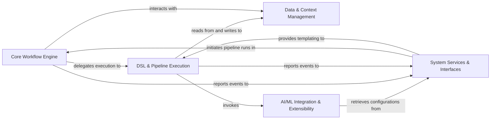

## Details

The Pipelex architecture is designed as an extensible AI/ML workflow orchestration framework, centered around a Core Workflow Engine that manages the entire pipeline lifecycle.

### Core Workflow Engine [[Expand]](./Core_Workflow_Engine.md)
The central orchestrator responsible for the overall lifecycle of Pipelex applications, including parsing, loading, and coordinating pipeline execution. It acts as the primary entry point for initiating workflows.

**Related Classes/Methods**:

- <a href="https://github.com/Pipelex/pipelex/blob/main/pipelex/pipelex.py#L61-L301" target="_blank" rel="noopener noreferrer">`pipelex.pipelex.Pipelex`:61-301</a>
- <a href="https://github.com/Pipelex/pipelex/blob/main/pipelex/hub.py#L39-L299" target="_blank" rel="noopener noreferrer">`pipelex.hub.PipelexHub`:39-299</a>
- <a href="https://github.com/Pipelex/pipelex/blob/main/pipelex/pipeline/execute.py#L25-L111" target="_blank" rel="noopener noreferrer">`pipelex.pipeline.execute.execute_pipeline`:25-111</a>

### DSL & Pipeline Execution [[Expand]](./DSL_Pipeline_Execution.md)
Defines the domain-specific language elements (Domains, Concepts, Pipes) and implements the concrete execution logic for pipeline steps, including sequential, conditional, parallel, and batch control flows.

**Related Classes/Methods**:

- <a href="https://github.com/Pipelex/pipelex/blob/main/pipelex/pipe_controllers/pipe_controller.py#L14-L79" target="_blank" rel="noopener noreferrer">`pipelex.pipe_controllers.pipe_controller.PipeController`:14-79</a>
- <a href="https://github.com/Pipelex/pipelex/blob/main/pipelex/pipe_controllers/pipe_sequence.py#L23-L195" target="_blank" rel="noopener noreferrer">`pipelex.pipe_controllers.pipe_sequence.PipeSequence`:23-195</a>
- <a href="https://github.com/Pipelex/pipelex/blob/main/pipelex/pipe_controllers/pipe_batch.py#L27-L247" target="_blank" rel="noopener noreferrer">`pipelex.pipe_controllers.pipe_batch.PipeBatch`:27-247</a>
- <a href="https://github.com/Pipelex/pipelex/blob/main/pipelex/pipe_controllers/pipe_condition.py#L32-L379" target="_blank" rel="noopener noreferrer">`pipelex.pipe_controllers.pipe_condition.PipeCondition`:32-379</a>
- <a href="https://github.com/Pipelex/pipelex/blob/main/pipelex/pipe_operators/pipe_operator.py#L16-L90" target="_blank" rel="noopener noreferrer">`pipelex.pipe_operators.pipe_operator.PipeOperator`:16-90</a>
- <a href="https://github.com/Pipelex/pipelex/blob/main/pipelex/core/concept.py" target="_blank" rel="noopener noreferrer">`pipelex.core.concept.Concept`</a>
- <a href="https://github.com/Pipelex/pipelex/blob/main/pipelex/core/domain.py#L14-L27" target="_blank" rel="noopener noreferrer">`pipelex.core.domain.Domain`:14-27</a>
- <a href="https://github.com/Pipelex/pipelex/blob/main/pipelex/libraries/library_manager.py#L56-L406" target="_blank" rel="noopener noreferrer">`pipelex.libraries.library_manager.LibraryManager`:56-406</a>

### Data & Context Management [[Expand]](./Data_Context_Management.md)
Provides a dynamic, in-memory store for all data ("Stuff") and the execution context relevant to a pipeline's run, enabling seamless data passing and state management between pipeline steps.

**Related Classes/Methods**:

- <a href="https://github.com/Pipelex/pipelex/blob/main/pipelex/core/working_memory.py#L39-L376" target="_blank" rel="noopener noreferrer">`pipelex.core.working_memory.WorkingMemory`:39-376</a>
- <a href="https://github.com/Pipelex/pipelex/blob/main/pipelex/core/stuff.py#L26-L198" target="_blank" rel="noopener noreferrer">`pipelex.core.stuff.Stuff`:26-198</a>

### AI/ML Integration & Extensibility [[Expand]](./AI_ML_Integration_Extensibility.md)
Offers a unified facade for interacting with various AI/ML models (LLMs, Image Generators, OCR engines) from different platforms and manages the integration and lifecycle of external AI/ML SDKs and plugins.

**Related Classes/Methods**:

- <a href="https://github.com/Pipelex/pipelex/blob/main/pipelex/cogt/inference/inference_manager.py#L23-L186" target="_blank" rel="noopener noreferrer">`pipelex.cogt.inference.inference_manager.InferenceManager`:23-186</a>
- <a href="https://github.com/Pipelex/pipelex/blob/main/pipelex/cogt/content_generation/content_generator.py#L39-L281" target="_blank" rel="noopener noreferrer">`pipelex.cogt.content_generation.content_generator.ContentGenerator`:39-281</a>
- <a href="https://github.com/Pipelex/pipelex/blob/main/pipelex/plugins/plugin_manager.py#L9-L27" target="_blank" rel="noopener noreferrer">`pipelex.plugins.plugin_manager.PluginManager`:9-27</a>

### System Services & Interfaces [[Expand]](./System_Services_Interfaces.md)
Encompasses foundational utilities such as configuration and secrets management, templating capabilities, user interaction points (CLI, programmatic client API), and comprehensive monitoring, tracking, and reporting functionalities for pipeline execution and costs.

**Related Classes/Methods**:

- <a href="https://github.com/Pipelex/pipelex/blob/main/pipelex/reporting/reporting_manager.py#L30-L122" target="_blank" rel="noopener noreferrer">`pipelex.reporting.reporting_manager.ReportingManager`:30-122</a>
- <a href="https://github.com/Pipelex/pipelex/blob/main/pipelex/pipeline/track/pipeline_tracker.py#L30-L358" target="_blank" rel="noopener noreferrer">`pipelex.pipeline.track.pipeline_tracker.PipelineTracker`:30-358</a>
- <a href="https://github.com/Pipelex/pipelex/blob/main/pipelex/tools/templating/jinja2_rendering.py#L34-L102" target="_blank" rel="noopener noreferrer">`pipelex.tools.templating.jinja2_rendering.render_jinja2`:34-102</a>
- <a href="https://github.com/Pipelex/pipelex/blob/main/pipelex/client/client.py#L16-L121" target="_blank" rel="noopener noreferrer">`pipelex.client.client.PipelexClient`:16-121</a>

### [FAQ](https://github.com/CodeBoarding/GeneratedOnBoardings/tree/main?tab=readme-ov-file#faq)
