```mermaid
graph LR
    Pipelex_Core_User_Interface["Pipelex Core & User Interface"]
    Pipeline_Definition_Data_Schema["Pipeline Definition & Data Schema"]
    Workflow_Execution_Engine["Workflow Execution Engine"]
    Pipe_Operators_Working_Memory["Pipe Operators & Working Memory"]
    AI_Service_Integration_Layer["AI Service Integration Layer"]
    Pipeline_Observability_Reporting["Pipeline Observability & Reporting"]
    Pipelex_Core_User_Interface -- "initiates pipeline execution" --> Pipeline_Definition_Data_Schema
    Pipeline_Observability_Reporting -- "provides execution reports" --> Pipelex_Core_User_Interface
    Pipeline_Definition_Data_Schema -- "provides executable pipeline structure" --> Workflow_Execution_Engine
    Pipeline_Definition_Data_Schema -- "defines data schemas" --> Pipe_Operators_Working_Memory
    Workflow_Execution_Engine -- "orchestrates pipe execution" --> Pipe_Operators_Working_Memory
    Workflow_Execution_Engine -- "sends execution events" --> Pipeline_Observability_Reporting
    Pipe_Operators_Working_Memory -- "requests AI services" --> AI_Service_Integration_Layer
    AI_Service_Integration_Layer -- "provides AI service responses" --> Pipe_Operators_Working_Memory
    Pipe_Operators_Working_Memory -- "sends activity events" --> Pipeline_Observability_Reporting
    click Pipelex_Core_User_Interface href "https://github.com/Pipelex/pipelex/blob/main/.codeboarding/Pipelex_Core_User_Interface.md" "Details"
    click Pipeline_Definition_Data_Schema href "https://github.com/Pipelex/pipelex/blob/main/.codeboarding/Pipeline_Definition_Data_Schema.md" "Details"
    click Workflow_Execution_Engine href "https://github.com/Pipelex/pipelex/blob/main/.codeboarding/Workflow_Execution_Engine.md" "Details"
    click Pipe_Operators_Working_Memory href "https://github.com/Pipelex/pipelex/blob/main/.codeboarding/Pipe_Operators_Working_Memory.md" "Details"
    click AI_Service_Integration_Layer href "https://github.com/Pipelex/pipelex/blob/main/.codeboarding/AI_Service_Integration_Layer.md" "Details"
    click Pipeline_Observability_Reporting href "https://github.com/Pipelex/pipelex/blob/main/.codeboarding/Pipeline_Observability_Reporting.md" "Details"
```

## Details

The Pipelex architecture is designed around a workflow-centric, modular pipeline pattern, enabling declarative AI workflow automation. At its core, the Pipelex Core & User Interface serves as the central orchestrator, allowing users to define and initiate complex AI pipelines. These pipelines are structured by the Pipeline Definition & Data Schema, which translates declarative blueprints into executable workflows. The Workflow Execution Engine then takes charge, orchestrating the execution of individual Pipe Operators & Working Memory components. These operators perform the actual data processing, managing transient data within their working memory, and seamlessly integrating with various external AI services via the AI Service Integration Layer. Throughout the entire process, the Pipeline Observability & Reporting component provides comprehensive tracking and reporting, ensuring transparency and debuggability of the AI workflows. This design facilitates clear data and control flow, making it ideal for visual diagram generation that highlights the progression of data through defined stages and interactions with external AI capabilities.

### Pipelex Core & User Interface [[Expand]](./Pipelex_Core_User_Interface.md)
The central application entry point and control unit, handling user interactions (CLI/Client) and orchestrating the overall system. It manages application initialization, configuration loading, and command handling.

**Related Classes/Methods**:

- <a href="https://github.com/Pipelex/pipelex/blob/main/pipelex/pipelex.py#L61-L305" target="_blank" rel="noopener noreferrer">`pipelex.pipelex`:61-305</a>
- <a href="https://github.com/Pipelex/pipelex/blob/main/pipelex/hub.py" target="_blank" rel="noopener noreferrer">`pipelex.hub`</a>
- <a href="https://github.com/Pipelex/pipelex/blob/main/pipelex/cli/commands/__init__.py" target="_blank" rel="noopener noreferrer">`pipelex.cli.commands.__init__`</a>
- <a href="https://github.com/Pipelex/pipelex/blob/main/pipelex/client/client.py" target="_blank" rel="noopener noreferrer">`pipelex.client.client`</a>

### Pipeline Definition & Data Schema [[Expand]](./Pipeline_Definition_Data_Schema.md)
Manages the declarative definition of pipelines (e.g., TOML parsing) and the underlying data structures (concepts, domains) that define the data flowing through the pipes. It translates blueprints into executable internal representations.

**Related Classes/Methods**:

- <a href="https://github.com/Pipelex/pipelex/blob/main/pipelex/core/interpreter.py" target="_blank" rel="noopener noreferrer">`pipelex.core.interpreter`</a>
- <a href="https://github.com/Pipelex/pipelex/blob/main/pipelex/core/pipes/pipe_factory.py" target="_blank" rel="noopener noreferrer">`pipelex.core.pipes.pipe_factory`</a>
- <a href="https://github.com/Pipelex/pipelex/blob/main/pipelex/core/pipes/pipe_library.py" target="_blank" rel="noopener noreferrer">`pipelex.core.pipes.pipe_library`</a>
- <a href="https://github.com/Pipelex/pipelex/blob/main/pipelex/libraries/library_manager.py" target="_blank" rel="noopener noreferrer">`pipelex.libraries.library_manager`</a>
- <a href="https://github.com/Pipelex/pipelex/blob/main/pipelex/core/concepts/concept_library.py" target="_blank" rel="noopener noreferrer">`pipelex.core.concepts.concept_library`</a>
- <a href="https://github.com/Pipelex/pipelex/blob/main/pipelex/core/domains/domain_library.py" target="_blank" rel="noopener noreferrer">`pipelex.core.domains.domain_library`</a>

### Workflow Execution Engine [[Expand]](./Workflow_Execution_Engine.md)
The core engine that orchestrates the execution of individual pipes within a defined pipeline. It manages control flow logic such as sequencing, conditional branching, and parallel execution, ensuring pipes are executed in the correct order.

**Related Classes/Methods**:

- <a href="https://github.com/Pipelex/pipelex/blob/main/pipelex/pipe_controllers/pipe_controller.py" target="_blank" rel="noopener noreferrer">`pipelex.pipe_controllers.pipe_controller`</a>
- <a href="https://github.com/Pipelex/pipelex/blob/main/pipelex/pipe_controllers/sequence/pipe_sequence.py" target="_blank" rel="noopener noreferrer">`pipelex.pipe_controllers.sequence.pipe_sequence`</a>
- <a href="https://github.com/Pipelex/pipelex/blob/main/pipelex/pipe_controllers/condition/pipe_condition.py" target="_blank" rel="noopener noreferrer">`pipelex.pipe_controllers.condition.pipe_condition`</a>
- <a href="https://github.com/Pipelex/pipelex/blob/main/pipelex/pipeline/pipeline_manager.py" target="_blank" rel="noopener noreferrer">`pipelex.pipeline.pipeline_manager`</a>

### Pipe Operators & Working Memory [[Expand]](./Pipe_Operators_Working_Memory.md)
Atomic, pluggable units of work that perform specific data processing tasks. These operators interact directly with an internal transient data store (working memory) and utilize templating for dynamic content generation and manipulation.

**Related Classes/Methods**:

- <a href="https://github.com/Pipelex/pipelex/blob/main/pipelex/pipe_operators/pipe_operator.py" target="_blank" rel="noopener noreferrer">`pipelex.pipe_operators.pipe_operator`</a>
- <a href="https://github.com/Pipelex/pipelex/blob/main/pipelex/pipe_operators/llm/pipe_llm.py" target="_blank" rel="noopener noreferrer">`pipelex.pipe_operators.llm.pipe_llm`</a>
- <a href="https://github.com/Pipelex/pipelex/blob/main/pipelex/pipe_operators/ocr/pipe_ocr.py" target="_blank" rel="noopener noreferrer">`pipelex.pipe_operators.ocr.pipe_ocr`</a>
- <a href="https://github.com/Pipelex/pipelex/blob/main/pipelex/pipe_operators/img_gen/pipe_img_gen.py" target="_blank" rel="noopener noreferrer">`pipelex.pipe_operators.img_gen.pipe_img_gen`</a>
- <a href="https://github.com/Pipelex/pipelex/blob/main/pipelex/core/memory/working_memory.py" target="_blank" rel="noopener noreferrer">`pipelex.core.memory.working_memory`</a>
- <a href="https://github.com/Pipelex/pipelex/blob/main/pipelex/core/stuffs/stuff.py" target="_blank" rel="noopener noreferrer">`pipelex.core.stuffs.stuff`</a>
- <a href="https://github.com/Pipelex/pipelex/blob/main/pipelex/core/stuffs/stuff_factory.py" target="_blank" rel="noopener noreferrer">`pipelex.core.stuffs.stuff_factory`</a>
- <a href="https://github.com/Pipelex/pipelex/blob/main/pipelex/tools/templating/jinja2_rendering.py" target="_blank" rel="noopener noreferrer">`pipelex.tools.templating.jinja2_rendering`</a>
- <a href="https://github.com/Pipelex/pipelex/blob/main/pipelex/tools/templating/template_library.py" target="_blank" rel="noopener noreferrer">`pipelex.tools.templating.template_library`</a>

### AI Service Integration Layer [[Expand]](./AI_Service_Integration_Layer.md)
Provides a unified and abstracted interface for interacting with various external AI/ML services (e.g., LLMs, Image Generation, OCR). It manages different AI provider adapters (plugins) and handles service requests, abstracting away third-party API specifics.

**Related Classes/Methods**:

- <a href="https://github.com/Pipelex/pipelex/blob/main/pipelex/cogt/inference/inference_manager.py" target="_blank" rel="noopener noreferrer">`pipelex.cogt.inference.inference_manager`</a>
- <a href="https://github.com/Pipelex/pipelex/blob/main/pipelex/cogt/llm/llm_worker_abstract.py" target="_blank" rel="noopener noreferrer">`pipelex.cogt.llm.llm_worker_abstract`</a>
- <a href="https://github.com/Pipelex/pipelex/blob/main/pipelex/cogt/imgg/imgg_worker_abstract.py" target="_blank" rel="noopener noreferrer">`pipelex.cogt.imgg.imgg_worker_abstract`</a>
- <a href="https://github.com/Pipelex/pipelex/blob/main/pipelex/cogt/ocr/ocr_worker_abstract.py" target="_blank" rel="noopener noreferrer">`pipelex.cogt.ocr.ocr_worker_abstract`</a>
- <a href="https://github.com/Pipelex/pipelex/blob/main/pipelex/plugins/plugin_manager.py" target="_blank" rel="noopener noreferrer">`pipelex.plugins.plugin_manager`</a>
- <a href="https://github.com/Pipelex/pipelex/blob/main/pipelex/plugins/openai/openai_config.py" target="_blank" rel="noopener noreferrer">`pipelex.plugins.openai.openai_config`</a>
- <a href="https://github.com/Pipelex/pipelex/blob/main/pipelex/plugins/anthropic/anthropic_config.py" target="_blank" rel="noopener noreferrer">`pipelex.plugins.anthropic.anthropic_config`</a>

### Pipeline Observability & Reporting [[Expand]](./Pipeline_Observability_Reporting.md)
Monitors pipeline execution, tracks activities, and generates reports and visualizations (e.g., flowcharts) for analysis, debugging, and operational insights. It provides the necessary data for understanding pipeline performance and behavior.

**Related Classes/Methods**:

- <a href="https://github.com/Pipelex/pipelex/blob/main/pipelex/pipeline/track/pipeline_tracker.py" target="_blank" rel="noopener noreferrer">`pipelex.pipeline.track.pipeline_tracker`</a>
- <a href="https://github.com/Pipelex/pipelex/blob/main/pipelex/pipeline/track/flow_chart.py" target="_blank" rel="noopener noreferrer">`pipelex.pipeline.track.flow_chart`</a>
- <a href="https://github.com/Pipelex/pipelex/blob/main/pipelex/reporting/reporting_manager.py" target="_blank" rel="noopener noreferrer">`pipelex.reporting.reporting_manager`</a>
- <a href="https://github.com/Pipelex/pipelex/blob/main/pipelex/pipeline/activity/activity_manager.py" target="_blank" rel="noopener noreferrer">`pipelex.pipeline.activity.activity_manager`</a>

### [FAQ](https://github.com/CodeBoarding/GeneratedOnBoardings/tree/main?tab=readme-ov-file#faq)
