```mermaid
graph LR
    Core_Orchestration_Engine["Core Orchestration Engine"]
    Pipe_Operators["Pipe Operators"]
    AI_Integration_Layer["AI Integration Layer"]
    Configuration_Extensibility_Management["Configuration & Extensibility Management"]
    Data_Working_Memory["Data & Working Memory"]
    Client_API_Layer["Client & API Layer"]
    Observability_Reporting["Observability & Reporting"]
    Core_Orchestration_Engine -- "orchestrates execution of" --> Pipe_Operators
    Core_Orchestration_Engine -- "manages data flow with" --> Data_Working_Memory
    Core_Orchestration_Engine -- "loads configurations from" --> Configuration_Extensibility_Management
    Core_Orchestration_Engine -- "sends metrics to" --> Observability_Reporting
    Client_API_Layer -- "interacts with" --> Core_Orchestration_Engine
    Pipe_Operators -- "sends AI inference requests to" --> AI_Integration_Layer
    AI_Integration_Layer -- "utilizes configurations/plugins from" --> Configuration_Extensibility_Management
    AI_Integration_Layer -- "sends metrics to" --> Observability_Reporting
    Pipe_Operators -- "interacts with" --> Data_Working_Memory
    click Core_Orchestration_Engine href "https://github.com/Pipelex/pipelex/blob/main/.codeboarding/Core_Orchestration_Engine.md" "Details"
    click Pipe_Operators href "https://github.com/Pipelex/pipelex/blob/main/.codeboarding/Pipe_Operators.md" "Details"
    click AI_Integration_Layer href "https://github.com/Pipelex/pipelex/blob/main/.codeboarding/AI_Integration_Layer.md" "Details"
    click Configuration_Extensibility_Management href "https://github.com/Pipelex/pipelex/blob/main/.codeboarding/Configuration_Extensibility_Management.md" "Details"
    click Data_Working_Memory href "https://github.com/Pipelex/pipelex/blob/main/.codeboarding/Data_Working_Memory.md" "Details"
    click Client_API_Layer href "https://github.com/Pipelex/pipelex/blob/main/.codeboarding/Client_API_Layer.md" "Details"
    click Observability_Reporting href "https://github.com/Pipelex/pipelex/blob/main/.codeboarding/Observability_Reporting.md" "Details"
```

## Details

### Core Orchestration Engine [[Expand]](./Core_Orchestration_Engine.md)
Parses declarative TOML pipeline definitions, orchestrating the execution flow of individual Pipe Operators.

**Related Classes/Methods**:

- <a href="https://github.com/Pipelex/pipelex/blob/main/pipelex/pipelex.py#L60-L304" target="_blank" rel="noopener noreferrer">`pipelex.pipelex.Pipelex` (60:304)</a>
- <a href="https://github.com/Pipelex/pipelex/blob/main/pipelex/pipe_works/pipe_router.py#L15-L58" target="_blank" rel="noopener noreferrer">`pipelex.pipe_works.pipe_router.PipeRouter` (15:58)</a>
- <a href="https://github.com/Pipelex/pipelex/blob/main/pipelex/pipeline/pipeline_manager.py#L13-L43" target="_blank" rel="noopener noreferrer">`pipelex.pipeline.pipeline_manager.PipelineManager` (13:43)</a>

### Pipe Operators [[Expand]](./Pipe_Operators.md)
Reusable, modular units encapsulating specific tasks like LLM calls, image generation, or custom functions.

**Related Classes/Methods**:

- `pipelex.pipe_operators.pipe_operator`
- `pipelex.pipe_operators.pipe_llm`
- `pipelex.pipe_operators.pipe_img_gen`
- `pipelex.pipe_operators.pipe_ocr`
- `pipelex.pipe_operators.pipe_func`
- `pipelex.pipe_operators.pipe_jinja2`

### AI Integration Layer [[Expand]](./AI_Integration_Layer.md)
Provides a unified interface to various AI service providers, abstracting away their specific APIs, and is utilized by the Pipe Operators for AI-related tasks.

**Related Classes/Methods**:

- `pipelex.cogt.inference.inference_manager`
- `pipelex.cogt.llm`
- `pipelex.cogt.imgg`
- `pipelex.cogt.ocr`

### Configuration & Extensibility Management [[Expand]](./Configuration_Extensibility_Management.md)
Manages all workflow definitions, reusable components, and external plugins, which ensures the system's adaptability and future-proofing.

**Related Classes/Methods**:

- <a href="https://github.com/Pipelex/pipelex/blob/main/pipelex/config.py#L113-L116" target="_blank" rel="noopener noreferrer">`pipelex.config.PipelexConfig` (113:116)</a>
- `pipelex.tools.config.manager`
- <a href="https://github.com/Pipelex/pipelex/blob/main/pipelex/plugins/plugin_manager.py#L8-L26" target="_blank" rel="noopener noreferrer">`pipelex.plugins.plugin_manager.PluginManager` (8:26)</a>
- <a href="https://github.com/Pipelex/pipelex/blob/main/pipelex/libraries/library_manager.py#L55-L405" target="_blank" rel="noopener noreferrer">`pipelex.libraries.library_manager.LibraryManager` (55:405)</a>

### Data & Working Memory [[Expand]](./Data_Working_Memory.md)
Handles data flow and state within pipelines, providing a shared context for seamless information exchange between pipes.

**Related Classes/Methods**:

- <a href="https://github.com/Pipelex/pipelex/blob/main/pipelex/core/working_memory.py#L38-L375" target="_blank" rel="noopener noreferrer">`pipelex.core.working_memory.WorkingMemory` (38:375)</a>
- `pipelex.core.working_memory_factory`
- `pipelex.core.stuff`
- `pipelex.core.stuff_content`

### Client & API Layer [[Expand]](./Client_API_Layer.md)
Facilitates external interaction with the engine.

**Related Classes/Methods**:

- `pipelex.cli._cli`
- <a href="https://github.com/Pipelex/pipelex/blob/main/pipelex/pipelex.py#L60-L304" target="_blank" rel="noopener noreferrer">`pipelex.pipelex.Pipelex` (60:304)</a>

### Observability & Reporting [[Expand]](./Observability_Reporting.md)
Provides crucial insights into pipeline execution, performance, and costs, aiding in debugging and monitoring.

**Related Classes/Methods**:

- <a href="https://github.com/Pipelex/pipelex/blob/main/pipelex/reporting/reporting_manager.py#L29-L121" target="_blank" rel="noopener noreferrer">`pipelex.reporting.reporting_manager.ReportingManager` (29:121)</a>
- <a href="https://github.com/Pipelex/pipelex/blob/main/pipelex/pipeline/track/pipeline_tracker.py#L29-L357" target="_blank" rel="noopener noreferrer">`pipelex.pipeline.track.pipeline_tracker.PipelineTracker` (29:357)</a>
- `pipelex.tools.log.log`

### [FAQ](https://github.com/CodeBoarding/GeneratedOnBoardings/tree/main?tab=readme-ov-file#faq)
