```mermaid
graph LR
    User_Interface_System_Initialization["User Interface & System Initialization"]
    Workflow_Definition_Parsing["Workflow Definition & Parsing"]
    Pipeline_Orchestrator["Pipeline Orchestrator"]
    AI_Service_Abstraction["AI Service Abstraction"]
    Pipeline_Data_Store["Pipeline Data Store"]
    Configuration_Secrets_Management["Configuration & Secrets Management"]
    Monitoring_Reporting["Monitoring & Reporting"]
    Unclassified["Unclassified"]
    User_Interface_System_Initialization -- "initiates" --> Configuration_Secrets_Management
    User_Interface_System_Initialization -- "triggers" --> Workflow_Definition_Parsing
    Configuration_Secrets_Management -- "supplies settings to" --> Workflow_Definition_Parsing
    Workflow_Definition_Parsing -- "generates plan for" --> Pipeline_Orchestrator
    Pipeline_Orchestrator -- "receives settings from" --> Configuration_Secrets_Management
    Pipeline_Orchestrator -- "reads from and writes to" --> Pipeline_Data_Store
    Pipeline_Orchestrator -- "requests tasks from" --> AI_Service_Abstraction
    AI_Service_Abstraction -- "utilizes credentials from" --> Configuration_Secrets_Management
    Pipeline_Orchestrator -- "reports to" --> Monitoring_Reporting
    Pipeline_Data_Store -- "provides data for" --> Monitoring_Reporting
    click User_Interface_System_Initialization href "https://github.com/Pipelex/pipelex/blob/main/.codeboarding/User_Interface_System_Initialization.md" "Details"
    click Workflow_Definition_Parsing href "https://github.com/Pipelex/pipelex/blob/main/.codeboarding/Workflow_Definition_Parsing.md" "Details"
    click Pipeline_Orchestrator href "https://github.com/Pipelex/pipelex/blob/main/.codeboarding/Pipeline_Orchestrator.md" "Details"
    click AI_Service_Abstraction href "https://github.com/Pipelex/pipelex/blob/main/.codeboarding/AI_Service_Abstraction.md" "Details"
    click Pipeline_Data_Store href "https://github.com/Pipelex/pipelex/blob/main/.codeboarding/Pipeline_Data_Store.md" "Details"
    click Configuration_Secrets_Management href "https://github.com/Pipelex/pipelex/blob/main/.codeboarding/Configuration_Secrets_Management.md" "Details"
    click Monitoring_Reporting href "https://github.com/Pipelex/pipelex/blob/main/.codeboarding/Monitoring_Reporting.md" "Details"
```

## Details

The `pipelex` project is structured around a core pipeline execution engine that orchestrates AI-driven workflows. The `User Interface & System Initialization` component serves as the primary entry point, handling command-line interactions and bootstrapping the application environment. It initiates the `Configuration & Secrets Management` component to load necessary settings and credentials, which are then supplied to other components as needed.

The `Workflow Definition & Parsing` component is responsible for interpreting user-defined pipeline specifications, translating them into an executable format, and managing data schemas ("concepts") and external libraries. This parsed workflow is then passed to the `Pipeline Orchestrator`, the central execution engine.

The `Pipeline Orchestrator` manages the flow of data and execution of individual "pipes" within a pipeline. It interacts with the `Pipeline Data Store` to store and retrieve intermediate data artifacts ("stuffs") that flow between pipes. For AI-related tasks, the Orchestrator dispatches requests to the `AI Service Abstraction` layer, which provides a unified interface to various AI models (LLMs, Image Generation, OCR). The `AI Service Abstraction` component utilizes credentials from `Configuration & Secrets Management` to interact with external AI platforms.

Throughout the pipeline execution, the `Pipeline Orchestrator` reports its activities and metrics to the `Monitoring & Reporting` component. The `Monitoring & Reporting` component also receives data from the `Pipeline Data Store` to generate comprehensive reports and visual flowcharts, aiding in debugging and analysis.

### User Interface & System Initialization [[Expand]](./User_Interface_System_Initialization.md)
The entry point for user interaction, handling CLI commands, initial system setup, and environment bootstrapping.

**Related Classes/Methods**:

- <a href="https://github.com/Pipelex/pipelex/blob/mainpipelex/cli/_cli.py" target="_blank" rel="noopener noreferrer">`pipelex.cli._cli`</a>
- <a href="https://github.com/Pipelex/pipelex/blob/mainpipelex/_bootstrap_user_libs.py" target="_blank" rel="noopener noreferrer">`pipelex._bootstrap_user_libs`</a>

### Workflow Definition & Parsing [[Expand]](./Workflow_Definition_Parsing.md)
Responsible for interpreting the declarative PLX (TOML-based) workflow definitions, managing "concepts" (data schemas), and loading pipe and domain libraries into an executable internal representation.

**Related Classes/Methods**:

- `pipelex.core.interpreter.interpreter`
- <a href="https://github.com/Pipelex/pipelex/blob/mainpipelex/core/concepts/concept_library.py" target="_blank" rel="noopener noreferrer">`pipelex.core.concepts.concept_library`</a>
- <a href="https://github.com/Pipelex/pipelex/blob/mainpipelex/libraries/library_manager.py" target="_blank" rel="noopener noreferrer">`pipelex.libraries.library_manager`</a>

### Pipeline Orchestrator [[Expand]](./Pipeline_Orchestrator.md)
The core execution engine that controls the overall flow of a defined pipeline, managing sequential, parallel, conditional, and batch processing of individual "pipes."

**Related Classes/Methods**:

- <a href="https://github.com/Pipelex/pipelex/blob/mainpipelex/pipe_controllers/pipe_controller.py" target="_blank" rel="noopener noreferrer">`pipelex.pipe_controllers.pipe_controller`</a>
- <a href="https://github.com/Pipelex/pipelex/blob/mainpipelex/pipe_operators/pipe_operator.py" target="_blank" rel="noopener noreferrer">`pipelex.pipe_operators.pipe_operator`</a>

### AI Service Abstraction [[Expand]](./AI_Service_Abstraction.md)
Provides a unified interface for various AI inference capabilities, including Large Language Models (LLMs), Image Generation, and Optical Character Recognition (OCR), abstracting interactions with diverse external AI platforms.

**Related Classes/Methods**:

- <a href="https://github.com/Pipelex/pipelex/blob/mainpipelex/cogt/inference/inference_manager.py" target="_blank" rel="noopener noreferrer">`pipelex.cogt.inference.inference_manager`</a>
- <a href="https://github.com/Pipelex/pipelex/blob/mainpipelex/cogt/llm/llm_worker_abstract.py" target="_blank" rel="noopener noreferrer">`pipelex.cogt.llm.llm_worker_abstract`</a>
- <a href="https://github.com/Pipelex/pipelex/blob/mainpipelex/cogt/imgg/imgg_engine.py" target="_blank" rel="noopener noreferrer">`pipelex.cogt.imgg.imgg_engine`</a>
- <a href="https://github.com/Pipelex/pipelex/blob/mainpipelex/cogt/ocr/ocr_worker_abstract.py" target="_blank" rel="noopener noreferrer">`pipelex.cogt.ocr.ocr_worker_abstract`</a>
- <a href="https://github.com/Pipelex/pipelex/blob/mainpipelex/cogt/content_generation/content_generator.py" target="_blank" rel="noopener noreferrer">`pipelex.cogt.content_generation.content_generator`</a>
- <a href="https://github.com/Pipelex/pipelex/blob/mainpipelex/plugins/plugin_manager.py" target="_blank" rel="noopener noreferrer">`pipelex.plugins.plugin_manager`</a>

### Pipeline Data Store [[Expand]](./Pipeline_Data_Store.md)
The central, ephemeral data store (working memory) for a running pipeline, holding "stuffs" (data artifacts) that flow between pipes, facilitating data exchange and context management.

**Related Classes/Methods**:

- `pipelex.core.memory.memory_manager`

### Configuration & Secrets Management [[Expand]](./Configuration_Secrets_Management.md)
Manages the loading, validation, and secure handling of project-wide configurations and sensitive information like API keys and credentials.

**Related Classes/Methods**:

- `pipelex.tools.config.config_manager`
- `pipelex.tools.secrets.secrets_manager`

### Monitoring & Reporting [[Expand]](./Monitoring_Reporting.md)
Monitors and records pipeline execution, capturing activity logs, usage metrics, and generating various reports, including visual flowcharts, for debugging and analysis.

**Related Classes/Methods**:

- `pipelex.pipeline.track.tracker`
- `pipelex.reporting.reporter`

### Unclassified
Component for all unclassified files and utility functions (Utility functions/External Libraries/Dependencies)

**Related Classes/Methods**: _None_

### [FAQ](https://github.com/CodeBoarding/GeneratedOnBoardings/tree/main?tab=readme-ov-file#faq)
